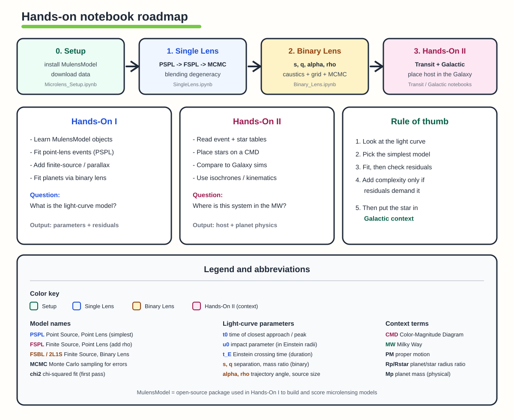
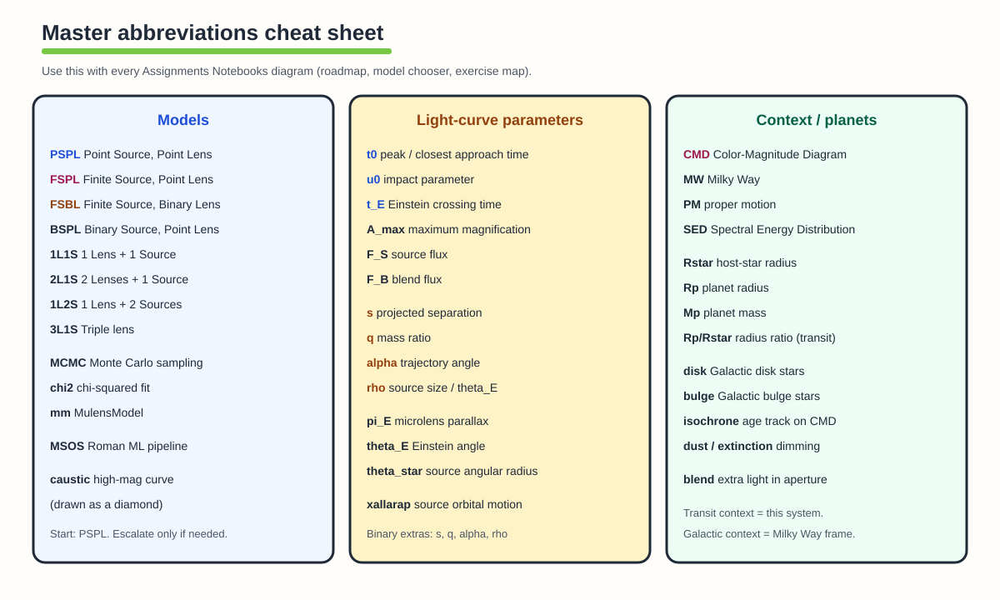
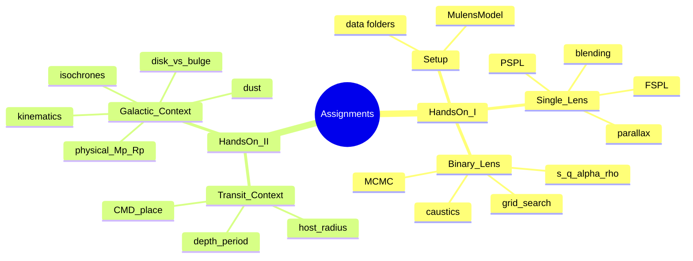
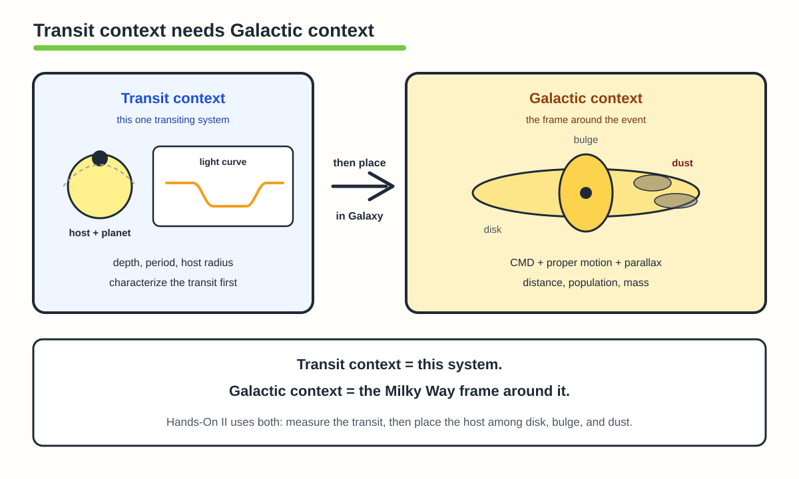
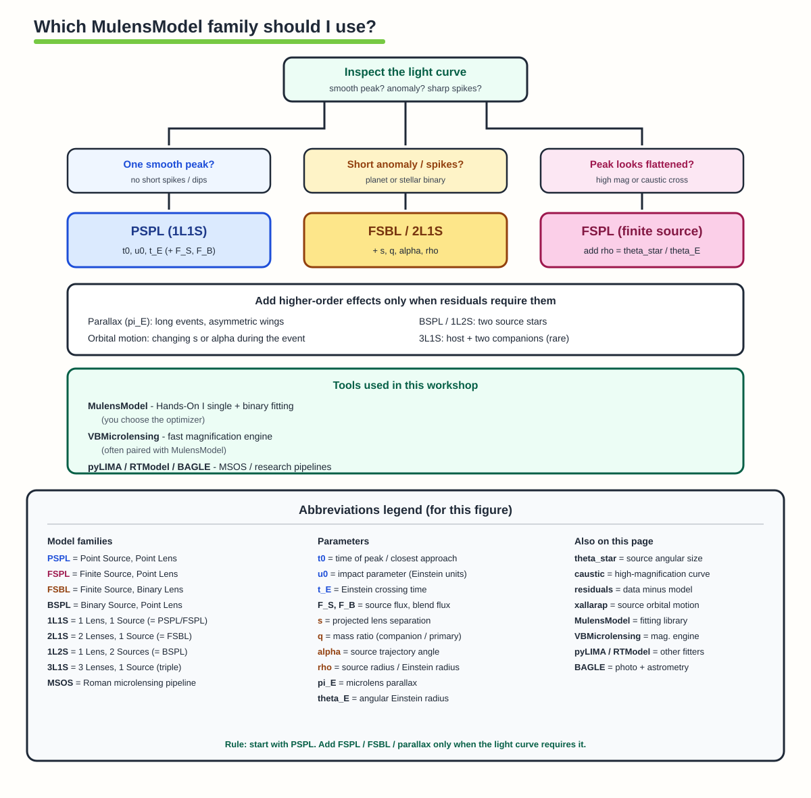
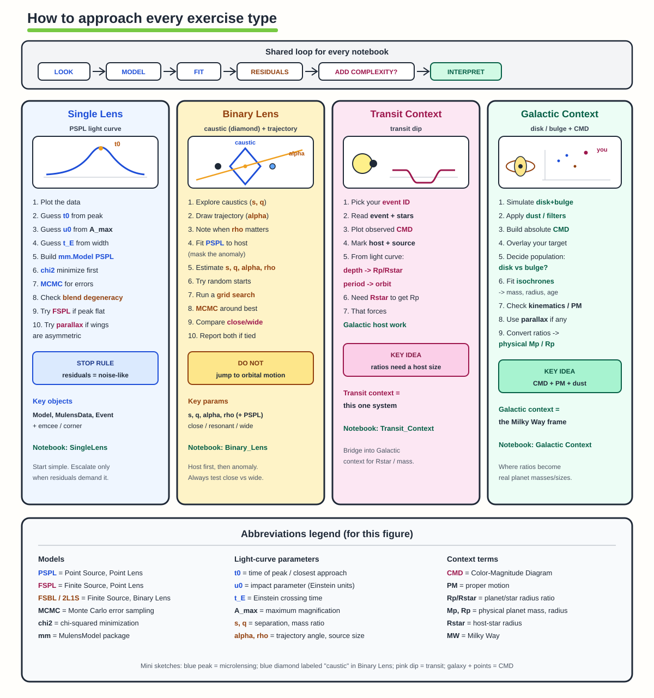
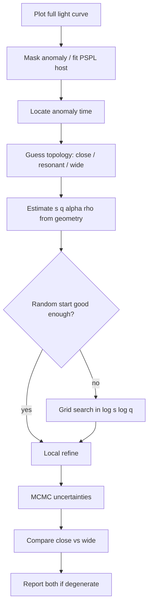
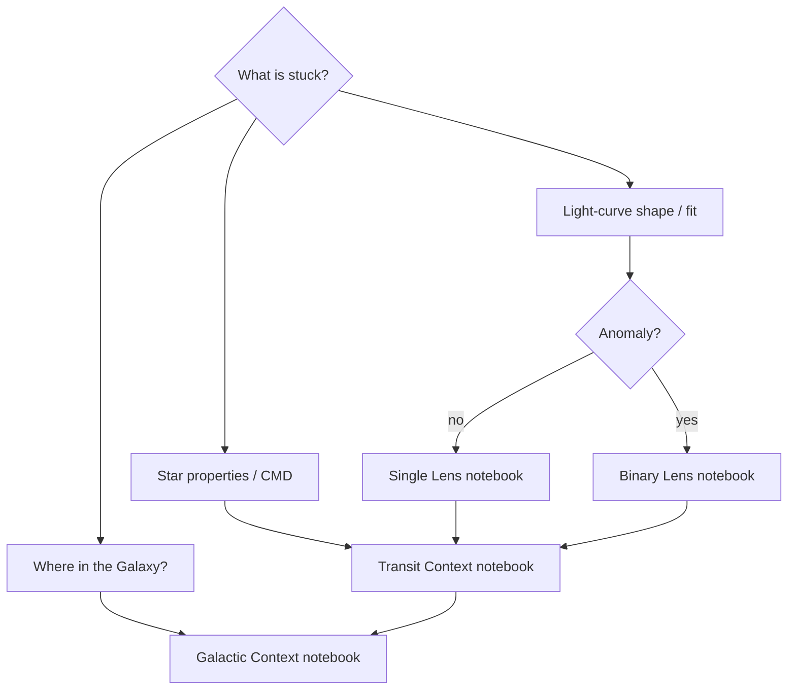

# Assignments Notebooks — Hands-On Guide

Study map for the five Sagan Summer Workshop 2026 notebooks in this folder. Use it before you open Colab: which notebook to run, which Mulens model to pick, and how to approach each exercise type.

Every diagram in this folder carries an abbreviations panel. Full cheat sheet:

| Abbreviation | Meaning |
|---|---|
| **PSPL** | Point Source, Point Lens — start here for a smooth single peak |
| **FSPL** | Finite Source, Point Lens — add when the peak is flattened (`rho`) |
| **FSBL / 2L1S** | Finite Source, Binary Lens — planets / stellar binaries |
| **1L1S / 2L1S / 1L2S / 3L1S** | lens × source counts (same idea as PSPL/FSBL/BSPL/triple) |
| **MCMC** | Monte Carlo sampling — uncertainties after a χ² start |
| **t0, u0, t_E** | peak time, impact parameter, Einstein timescale |
| **s, q, alpha, rho** | binary separation, mass ratio, trajectory angle, source size |
| **F_S, F_B** | source flux, blend flux |
| **pi_E, theta_E** | microlens parallax; angular Einstein radius |
| **CMD** | Color–Magnitude Diagram |
| **MW, PM** | Milky Way; proper motion |
| **Rp/Rstar, Mp** | planet/star radius ratio; physical planet mass |
| **caustic** | high-magnification curve (drawn as a **diamond** in Binary Lens) |

Background concepts (outside this folder):

- [Microlensing fundamentals](../topics/03-microlensing-fundamentals.md)
- [Advanced models and fitting](../topics/04-advanced-microlensing-and-yields.md)
- [Transits](../topics/05-transits.md)
- [Galactic context and dust](../topics/06-galactic-context-and-dust.md)
- [Key concepts gallery](../KEY_CONCEPTS_GALLERY.md)

---

## Notebooks in this folder

| Order | Notebook | Session | What you practice |
|---:|---|---|---|
| 0 | [SSW2026_HandsOnI_Microlens_Setup.ipynb](SSW2026_HandsOnI_Microlens_Setup.ipynb) | Hands-On I | Drive layout, MulensModel download, data folders |
| 1 | [SSW2026_HandsOnI_SingleLens.ipynb](SSW2026_HandsOnI_SingleLens.ipynb) | Hands-On I | PSPL / FSPL, χ² + MCMC, blending degeneracy |
| 2 | [SSW2026_HandsOnI_Binary_Lens.ipynb](SSW2026_HandsOnI_Binary_Lens.ipynb) | Hands-On I | Caustics, FSBL fits, grid search, MCMC |
| 3 | [SSW2026_HandsOnII_Transit_Context.ipynb](SSW2026_HandsOnII_Transit_Context.ipynb) | Hands-On II | Event tables, CMD, host characterization |
| 4 | [Galactic Context_GroupProject_SSW2026.ipynb](Galactic%20Context_GroupProject_SSW2026.ipynb) | Hands-On II | Galaxy sims, isochrones, kinematics → physical masses |

Run **Setup → Single Lens → Binary Lens** first. Hands-On II assumes you already understand a light-curve fit and now want the **star’s place in the Milky Way**.

---

## Mind map: what each track is about

**Transit context** = what *this* system’s light curve and host photometry say (depth, period, radius ratio).  
**Galactic context** = which Milky Way population the host belongs to (disk/bulge, dust, distance, kinematics) so ratios become physical masses and radii.

---

## Models: MulensModel and when to use PSPL, FSPL, FSBL, …

Hands-On I uses **[MulensModel](https://github.com/rpoleski/MulensModel)** (with **VBMicrolensing** for fast magnifications). Mulens does **not** auto-pick the model family — you do. Names describe source × lens treatment:

The model-chooser figure includes its own **abbreviations legend** at the bottom (PSPL/FSPL/FSBL, 1L1S/2L1S, t0/u0/t_E, s/q/alpha/rho, pi_E, MSOS, tools).

| Acronym | Meaning | Use when… | Core parameters |
|---|---|---|---|
| **PSPL** (1L1S) | Point source, point lens | Smooth single peak; start here always | `t_0`, `u_0`, `t_E` (+ fluxes) |
| **FSPL** | Finite source, point lens | High magnification with a flattened / rounded peak | PSPL + `rho` |
| **FSBL** / **2L1S** | Finite source, binary lens | Short anomaly, spikes, or caustic crossings (planet / binary) | PSPL + `s`, `q`, `alpha`, `rho` |
| **BSPL** / **1L2S** | Binary source, point lens | Odd color or shape that a second source explains better than a second lens | two-source fluxes + PSPL |
| **BSBL** / **2L2S** | Binary source + binary lens | Rare; only if both are clearly needed | FSBL + second source |
| **3L1S** | Triple lens | Host + two companions; advanced / rare | extra mass ratios & separations |

Higher-order add-ons (not a new “lens count”):

| Effect | Add when… |
|---|---|
| **Parallax** (`pi_E_N`, `pi_E_E`) | Long events, asymmetric wings, Earth-acceleration signature |
| **Lens orbital motion** | Binary geometry changes during the event |
| **Xallarap** | Source orbit mimics parallax-like distortion |

### MulensModel objects you will touch every time

1. **`Model`** — geometric parameters (`t_0`, `u_0`, `t_E`, …). Adding `rho` turns PSPL into FSPL; adding `s`, `q`, `alpha` makes a binary lens.
2. **`MulensData`** — photometry (time, mag/flux, error).
3. **`Event`** — links model + data so you can compute χ² / residuals.

MulensModel **generates** light curves and scores fits; **you** choose the optimizer (χ² minimizer, `emcee` MCMC, grid search). Workshop research pipelines also mention **pyLIMA**, **RTModel**, and **BAGLE** (including the Roman **MSOS** pipeline) — same physics, different automation.

---

## How to approach every exercise type

The figure includes an **abbreviations legend** at the bottom (**PSPL**, **FSPL**, **t0**, **u0**, **t_E**, **s/q/alpha/rho**, **CMD**, **PM**, **Rp/Rstar**, etc.). Mini-sketch labels sit **above** each plot so they are not covered by the curves.

Concept sketches that match each column:

| Single Lens | Binary / complexity | Transit | Galactic |
|---|---|---|---|
|  |  |  |  |
|  |  |  |  |

### Shared checklist (all notebooks)

1. **Look** — plot the data before fitting anything.
2. **Guess** — write a physical first guess (**peak time**, **width**, anomaly location).
3. **Simplest model** — start with **PSPL**; only then add `rho` / binary / parallax.
4. **Fit** — local **χ²** first, then **MCMC** or a **grid** if multimodal.
5. **Residuals** — structured leftovers = missing physics; **noise-like = stop**.
6. **Degeneracies** — report competing solutions (**blend**, **close–wide**), not only lowest χ².
7. **Physical step** — convert dimensionless fits with **CMD / isochrones / Galactic priors**.

---

### 1. Single Lens (`SSW2026_HandsOnI_SingleLens.ipynb`)

**Goal:** learn Mulens objects and fit a **PSPL** event; explore **FSPL**, parallax demos, and the **`u_0`–`t_E`–blend** degeneracy.

**Approach outline**

1. Create three toy `Model`s and plot magnification — see how **`t_0`**, **`u_0`**, **`t_E`** move the peak.
2. Compare **PSPL vs FSPL** at low and high magnification (`rho` only matters when the source size is resolved).
3. Load photometry into **`MulensData`**.
4. Link with **`Event`**; **χ²-minimize** from a hand guess:
   - **`t_0`** ≈ time of peak  
   - **`u_0`** from peak magnification (ignore blend at first)  
   - **`t_E`** ≈ event width (FWHM-scale)
5. Re-fit with **emcee**; inspect chains and **corner** plots.
6. Turn blending on/off and map the **`u_0`–`t_E`–blend` degeneracy**.

**Stop / escalate**

- Residuals flat → done with **PSPL**.  
- Peak rounded at high mag → try **FSPL**.  
- Long asymmetric wings → try **parallax**.  
- Clear short spike → go to **Binary Lens**.

---

### 2. Binary Lens (`SSW2026_HandsOnI_Binary_Lens.ipynb`)

**Goal:** see how **`s`**, **`q`**, **`α`**, **`ρ`** set caustic topology; fit a planetary anomaly on a Roman-like light curve.

**Exercises map (as in the notebook)**

| Exercise | Focus |
|---:|---|
| 1 | Slider over **`s`**, **`q`** — **close / resonant / wide** caustics |
| 2 | Trajectory + light curve; major/minor image, **close–wide**, resonant |
| 3 | Turn on finite source (**`rho`**) for a caustic crossing |
| 4 | Fit a **PSPL** model to the host (**mask the anomaly**) |
| 5–6 | Geometric first guesses for **`s`**, **`q`**, **`α`**, **`ρ`** |
| 7 | Initial-condition **grid search** |
| 8 | **MCMC** around the best grid point |

**Approach outline**

**Rules of thumb**

- Fit the **host** first; the planet is a perturbation on **PSPL**.
- Test **both signs of `u_0`**.
- Always check the **close–wide** (`s` vs `~1/s`) pair.
- Need **`rho`** for caustic crossings / close approaches.
- Do **not** add orbital motion until static **FSBL** residuals demand it.

---

### 3. Transit Context (`SSW2026_HandsOnII_Transit_Context.ipynb`)

**Goal:** characterize *one* event/system from tables and a **CMD** before asking Galactic questions.

**Approach outline**

1. Mount data / paths; import tables.
2. Choose an **event ID** (e.g. `1292370`).
3. Inspect the **events** table.
4. Inspect the **stars** table (host / source photometry).
5. Plot **CMDs**; mark your stars.
6. From the light curve alone:
   - **depth → \(R_p/R_\star\)**
   - **period → orbit**
   - (microlensing-like: **`t_E`**, **`q`**, **`s`**)
7. Missing piece is almost always **host mass / radius / distance** → bridge into **Galactic context**.

**Key idea:** ratios need a **host size**.

**Questions before moving on**

- What is **measured** vs **assumed**?
- Is the host a **dwarf** or **giant** on the CMD?
- Would **blending/dilution** change the planet size?

---

### 4. Galactic Context (`Galactic Context_GroupProject_SSW2026.ipynb`)

**Goal:** put the target into a simulated Milky Way → **population, dust, isochrones, kinematics** → **physical** star/planet properties.

**Approach outline**

1. Load / select your target.
2. Build observed **CMDs**; mark lens/host and source.
3. Load the **Galaxy simulation**; separate **disk vs bulge**.
4. Convert intrinsic properties → observables (**filters + extinction**).
5. Overlay your target — which **population** fits?
6. Draw **isochrones**; estimate **mass** and **radius**.
7. Optional: **SED**, **proper motions**, **parallaxes**.
8. Convert dimensionless quantities into physical **\(M_p\)** / **\(R_p\)**.
9. State assumptions (**dust**, **distance**, **blend**) that still dominate errors.

**Key idea:** **CMD + PM + dust** together.

**Questions**

- **Disk or bulge** host? Evidence from CMD color / kinematics?
- How much does **dust** change the inferred luminosity?
- Which two of **{θ_E, π_E, lens flux, Galactic prior}** are you using?

---

## Quick “which notebook am I in?” flow

---

## Suggested study session

| Time block | Do this |
|---|---|
| 15 min | Setup notebook + confirm MulensModel imports |
| 45–60 min | Single Lens through χ² + one MCMC corner plot |
| 60–90 min | Binary Lens Exercises 1–4, then one grid + MCMC pass |
| 45–60 min | Transit Context: pick an event, finish CMD placement |
| 60+ min | Galactic Context group project through isochrones and a mass/radius estimate |

---

## Extra reading inside this repo

- Model ladder and fitting loop: [topics/04](../topics/04-advanced-microlensing-and-yields.md)
- Hands-on exercise sketches A–E: [topics/10](../topics/10-hands-on-and-resources.md)
- Colab instructions PDF: [SSW2026_Google_Colab_Instructions.pdf](../docs/SSW2026_Google_Colab_Instructions.pdf) (also linked from the course [README](../README.md))

Software links: [MulensModel](https://github.com/rpoleski/MulensModel) · [VBMicrolensing](https://github.com/valboz/VBMicrolensing) · [pyLIMA](https://github.com/ebachelet/pyLIMA) · [RTModel](https://github.com/valboz/RTModel) · [BAGLE](https://github.com/MovingUniverseLab/BAGLE_Microlensing)
