# Generated Diagrams Gallery: Basic to Advanced

Every **generated diagram** in `assets/generated/` - cleaner redraws of the most important workshop slides from [`Image ppt/best/`](Image%20ppt/best/). Ordered by the same learning path as the [README](README.md).

This file does **not** include:

- hand-drawn key-concept sketches → [key concepts gallery](KEY_CONCEPTS_GALLERY.md)
- original workshop ppt screenshots → [slides gallery](SLIDES_GALLERY.md)

| Level | Difficulty | Topic | Diagrams |
|---:|---|---|---:|
| 1 | Basic | [Roman and the GBTDS](topics/01-roman-and-gbtds.md) | 2 |
| 3 | Intermediate | [Microlensing fundamentals](topics/03-microlensing-fundamentals.md) | 1 |
| 4 | Advanced | [Advanced microlensing and yields](topics/04-advanced-microlensing-and-yields.md) | 3 |
| 8 | Advanced | [Pipelines and host stars](topics/08-pipelines.md) | 6 |

---

## Level 1 - Roman and the GBTDS (Basic)

### Filter coverage compared with other missions

Every telescope sees the sky through a set of filters, and the filter set determines what science is possible. Roman's bands stretch far into the near-infrared (out to 2300 nm), well beyond Rubin and Euclid's optical coverage. That matters because the bulge sits behind heavy dust, and infrared light passes through dust far more easily than blue light. The extra-wide F146 filter is the workhorse of the microlensing survey: wider bands collect more photons, which means better photometry on faint stars.

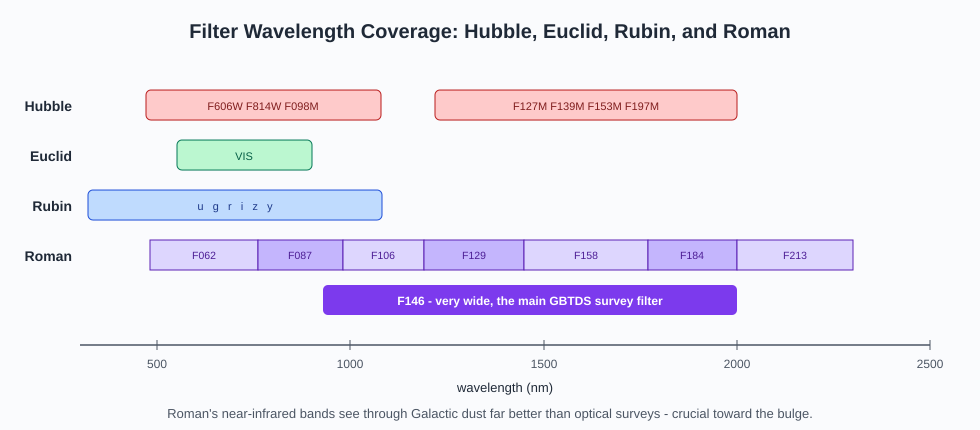

### Where Roman's planets will come from

Transit surveys like Kepler are most sensitive to planets that orbit close to their stars; microlensing is most sensitive to planets around and beyond the snow line, where ices condense and giant-planet cores are thought to grow. The two regions barely overlap - which is exactly the point. Roman's microlensing survey fills in the cold outer parts of planetary systems that no other technique can reach in large numbers.

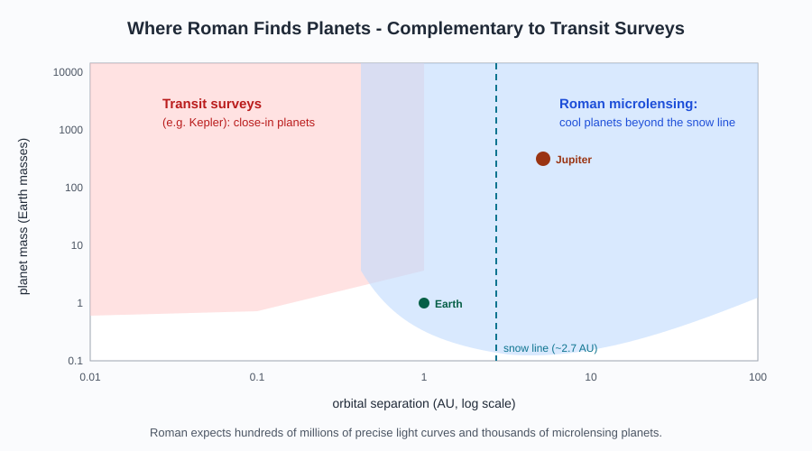

---

## Level 3 - Microlensing fundamentals (Intermediate)

### How to recognize a real event

Out of hundreds of millions of light curves, only a tiny fraction are microlensing. The four-point checklist - not flat, non-periodic, peaked, achromatic - separates lensing from the impostors. "Achromatic" is the most powerful test: gravity bends all wavelengths equally, so a true event has the same shape in every filter, while supernovae and variable stars change color as they evolve.

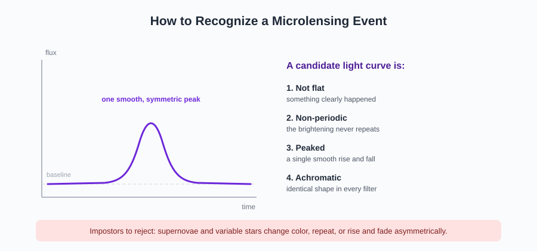

---

## Level 4 - Advanced microlensing and yields (Advanced)

### The full model-category table

The complete menu of standard microlensing models, from the point-source point-lens (PSPL) baseline up to triple-lens systems. The naming convention encodes the physics: how many lenses (L), how many sources (S), and whether the source is treated as a point or a disk of finite size. Higher-order effects like parallax and orbital motion can be bolted onto any of them - but only when the data demand it.

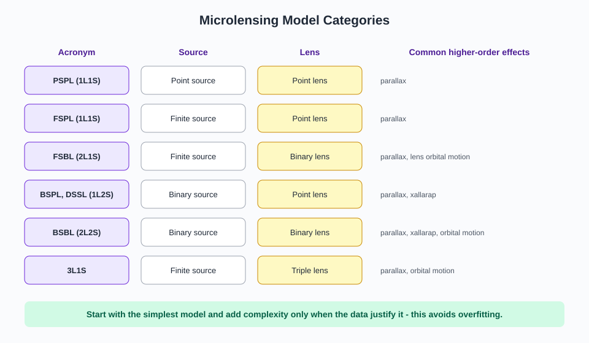

### The fitting loop

Every fitting tool, no matter how sophisticated, runs this same four-step cycle: guess parameters, predict a light curve, score the prediction against the data, and choose a better guess. The differences between MCMC, nested sampling, and grid searches are all in step 4 - how the next guess is chosen.

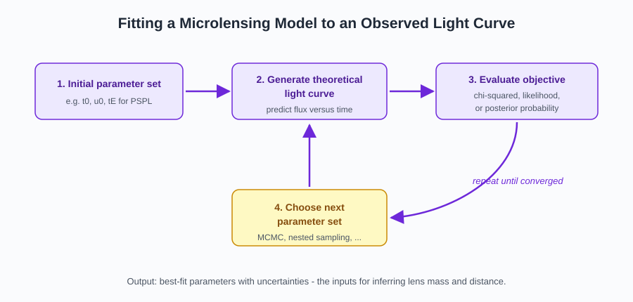

### The tools that implement it

Five public packages dominate published microlensing analyses, each with a specialty: BAGLE for joint photometry + astrometry and dark lenses, eesunhong for low-mass planets, MulensModel for flexible binary-lens work, pyLIMA as the first fully open-source package (and the MSOS single-lens fitter), and RTModel for fast automated binary fits (the MSOS binary-event basis). Real analyses often cross-check with more than one.

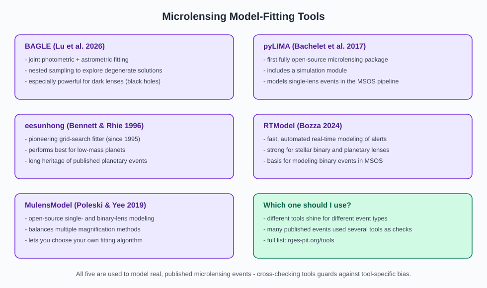

---

## Level 8 - Pipelines and host stars (Advanced)

### The full chain, from images to populations

The six-stage journey of Roman microlensing data: observe, measure brightness, identify candidates, model light curves, infer physical properties, and finally do population studies. Every stage filters and transforms the data, so the demographics at the end inherit every choice made upstream.

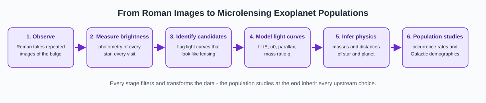

### What the official pipeline delivers

The Microlensing Science Operations System (MSOS) releases products on three clocks: light curves daily, event and variability catalogs each season, and the detection-efficiency catalog once per survey. The last one is the quiet hero - without it, none of the occurrence-rate math is possible.

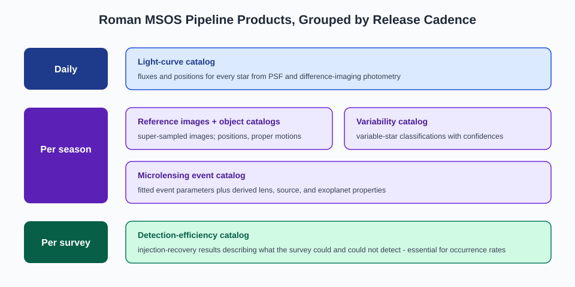

### The three-stage summary

The whole microlensing workflow compressed into three boxes: identify candidates, model their light curves, and infer physical properties. The third box carries the key rule of thumb: mass and distance need two of theta_E, pi_E, and lens flux - and when direct constraints are missing, you estimate them statistically with a Galactic model, which is exactly what the Hands-On II notebook does.

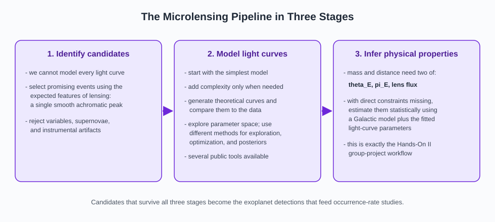

### Independent checks by the PIT

The Project Infrastructure Team plans its own quick-look analyses alongside the official pipeline: fast catalogs, searchable difference images, and small pixel cutouts around flagged events. The goal is complementarity - an independent path through the data catches problems the official pipeline might miss, and does so within days instead of a month.

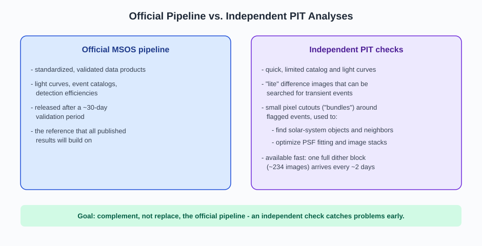

### How stars are characterized: SED fitting

To pin down a star, combine stellar models, a parallax, a dust map, and the filter curves into a predicted spectral energy distribution, then compare with the observed photometry. Each ingredient handles one physical effect: distance makes everything fainter, and reddening dims blue light more than red. Public tools like BRUTUS, isochrones, and isoclassify automate the loop.

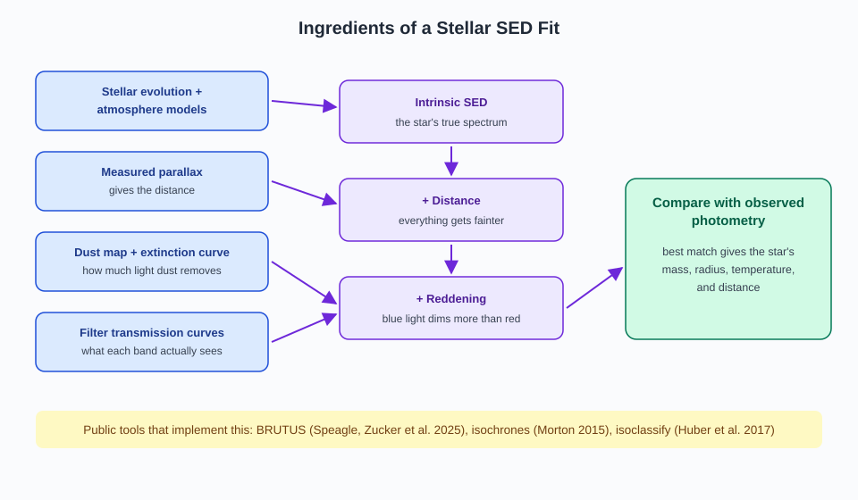

### The blending problem

At bulge distances, Roman cannot separate stars closer together than about 800 AU, so many "stars" in the catalog are actually two or more blended together. The extra light biases radii, ages, and planet properties - and in microlensing, the blend flux mixes lens, source, and neighbors, which is precisely why the Hands-On II notebook has a deblending step.

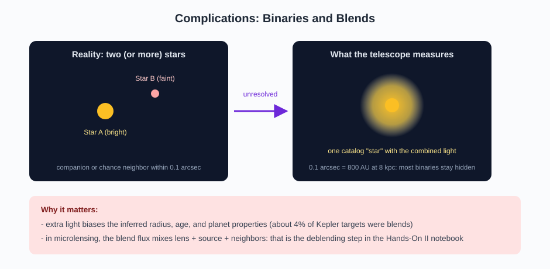

---

## Related galleries

- [Key concepts gallery](KEY_CONCEPTS_GALLERY.md) - beginner hand-drawn sketches only
- [Slides gallery](SLIDES_GALLERY.md) - original workshop slide screenshots
