# Key Concepts Gallery
> #### [From Stars to Galaxies, Every Paper in One Place](https://explorepathfinder.netlify.app/)

## Level 0 - Foundations

### Light and distance

Light leaves a star and spreads over a growing sphere. Move twice as far away and the same light is spread over four times the area, so the star looks four times fainter. Every later idea - magnitudes, distance moduli, extinction corrections - comes back to this one picture.

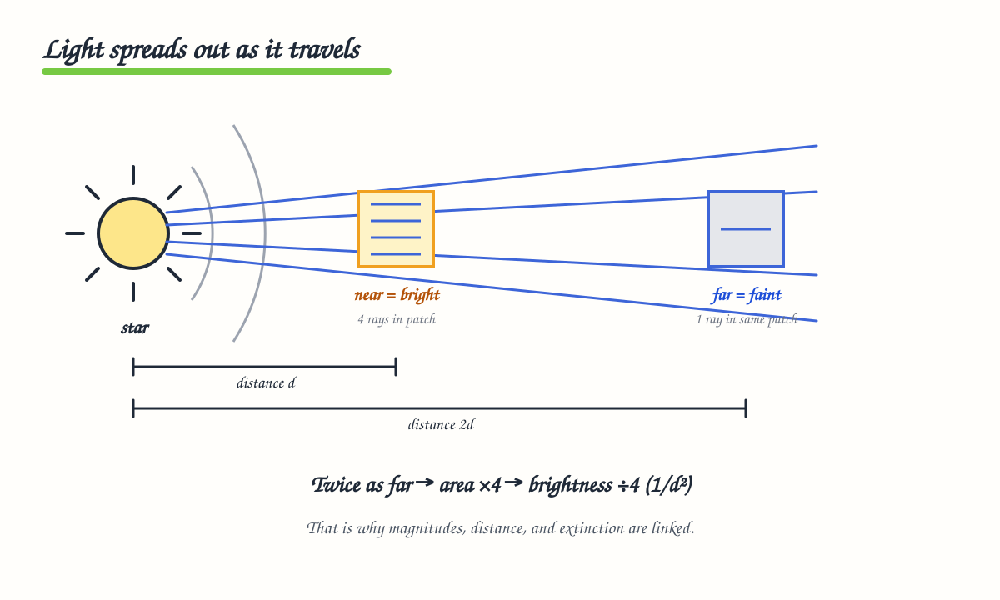

---

## Level 1 - Roman and the GBTDS

### Roman watches the same stars again and again

Roman stares at fields near the Galactic bulge and re-images them on a short cadence. That repetition is what makes the survey special: any star that brightens (microlensing) or dims (transit) leaves a time series. One camera, two planet-finding methods.

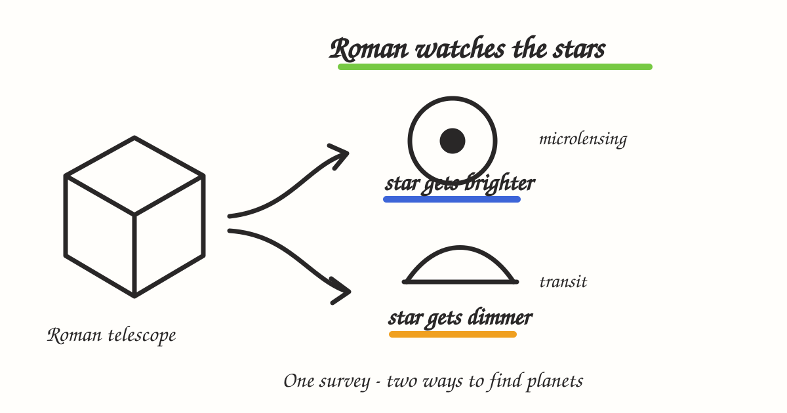

---

## Level 2 - Planet formation and populations

### Planets grow inside a disk

Dust grains collide and stick into rocky pieces, and those pieces grow into young planets inside a rotating disk around a new star. Later topics that mention the snow line, disk metallicity, or planet populations are all statements about steps in this chain.

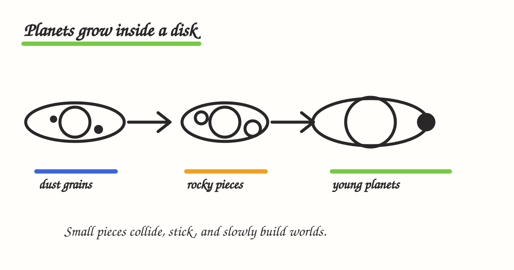

---

## Level 3 - Microlensing fundamentals

### Gravity bends light

A foreground lens star passes almost exactly in front of a far-away source star. The lens gravity bends and focuses the source light, so the source looks temporarily brighter. The lens does not need to shine - which is why microlensing can weigh dark objects, remnants, and planets that are otherwise invisible.

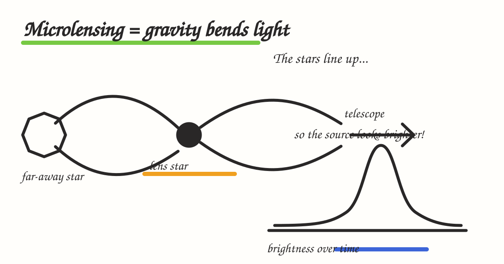

### Three numbers from a light curve

A simple event is summarized by when it peaked, how bright it got, and how long it lasted. The duration (the Einstein timescale, tE) carries the physics: it depends on lens mass, the distances, and how fast lens and source move relative to each other.

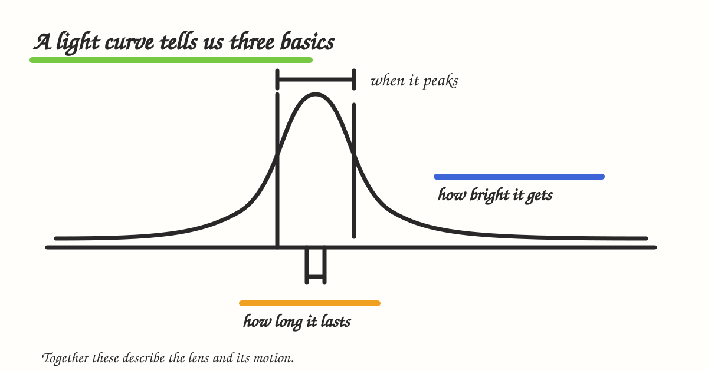

---

## Level 4 - Advanced microlensing and yields

### Extra clues reveal the hidden lens

tE alone cannot give the lens mass - a nearby light star and a distant heavy one can look the same. Extra measurables break that degeneracy: the Einstein angle (event size on the sky), microlensing parallax (a viewpoint shift), and the lens's own light. Usually you need two of these. Without them, a Galactic model supplies statistical estimates - which is exactly the Hands-On II workflow.

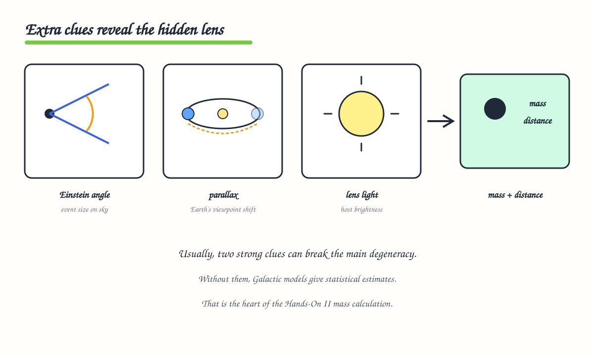

### Start simple, then add complexity

Begin with one lens. Add a second lens only if the data show a planet or binary. Add parallax or orbital motion only if those are required. Each new parameter must earn its place, or you risk overfitting noise and inventing false discoveries.

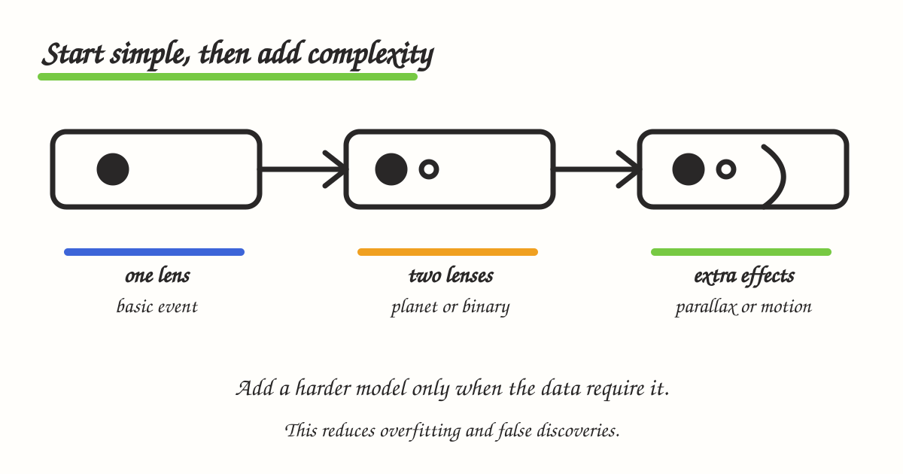

### Fitting means improving a guess

Every fitter runs the same loop: choose parameters, predict a light curve, compare with the data, score the fit, then choose a better guess. MCMC and nested sampling differ mainly in how that next guess is chosen. Try many starting points so a good solution is not missed.

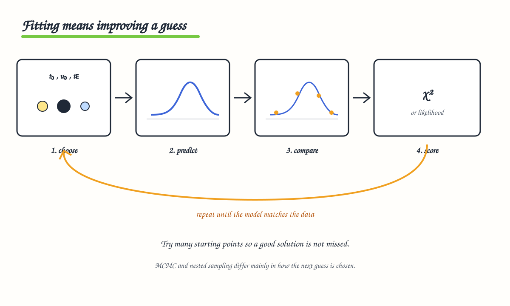

### A yield is a prediction

"Roman will find N planets" is a forecast built from three pieces: what the survey can detect, what planets nature provides, and the resulting expected discoveries. Change the Galaxy model or the planet model and the number changes. Yield is a forecast - not a promise.

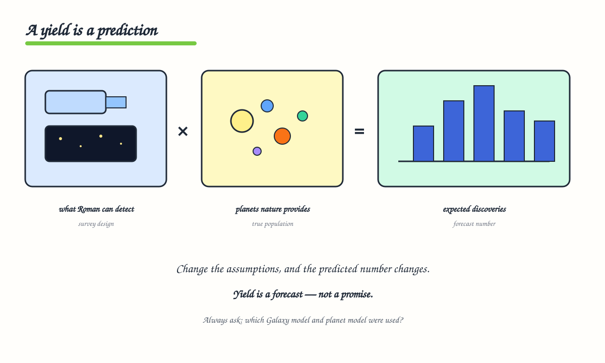

---

## Level 5 - Transits

### A planet blocks some light

When a planet crosses its star, it blocks a tiny fraction of the light and the light curve shows a small dip. A deeper dip means a larger planet relative to the star. Repeating dips give the orbital period.

### A dip is only a candidate

Noise, eclipsing binaries, and blended neighbors can all copy a transit signal. So the workflow is: find a repeating dip, check other causes, and keep only the best survivors. Vetting turns a candidate list into a reliable planet sample.

---

## Level 6 - Galactic context and dust

### The Milky Way changes what we can see

Looking toward the bulge means looking through crowded stars and dust. Dust dims and reddens background light; infrared helps Roman see through it. Disk, bulge, and nuclear stellar disk all overlap along the line of sight - which is why Hands-On II combines CMD, proper motion, and parallax instead of trusting photometry alone.

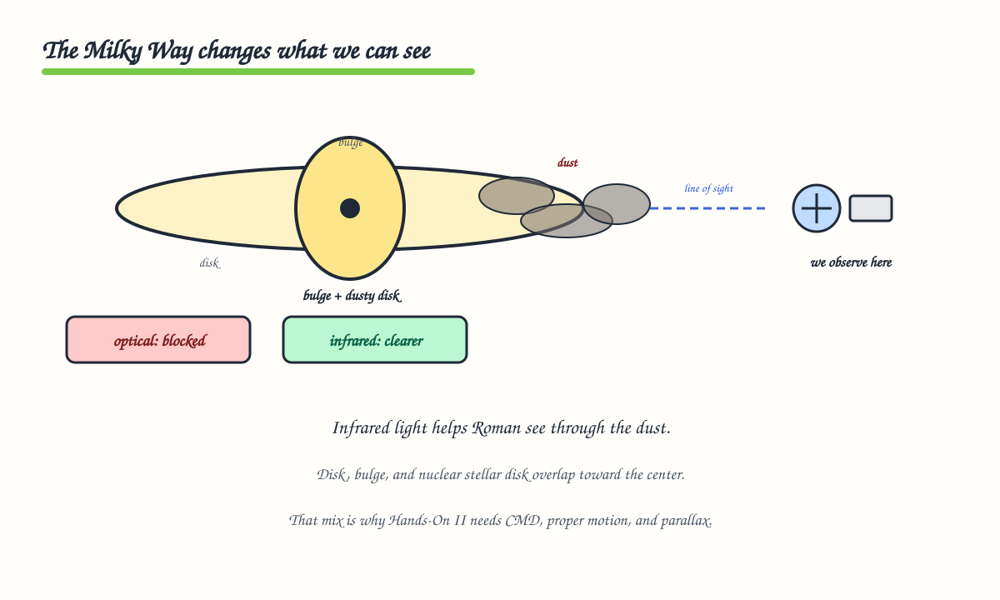

---

## Level 7 - Occurrence rates 

### Found planets are only part of the story

Surveys find easy planets and miss hard ones. To turn detections into a true population, correct for the planets that were probably missed. That correction is called completeness. Occurrence rates are detections divided by what could have been found.

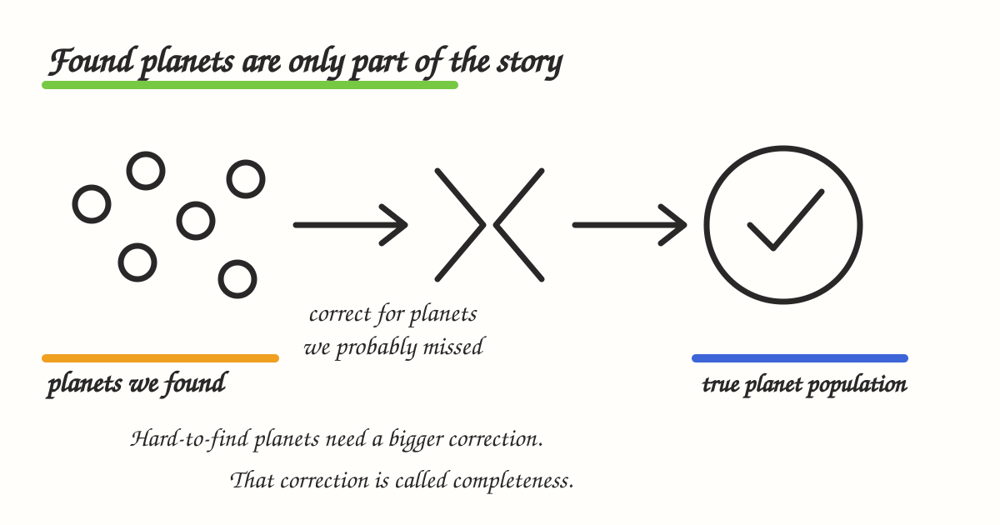

---

## Level 8 - Pipelines and host stars 

### A pipeline turns pictures into answers

Pixels become brightness-over-time, then a planet-signal check, then a planet list. Fixing those steps makes results reproducible and makes the selection effects knowable. Without that, the occurrence-rate math in Level 7 cannot be trusted.

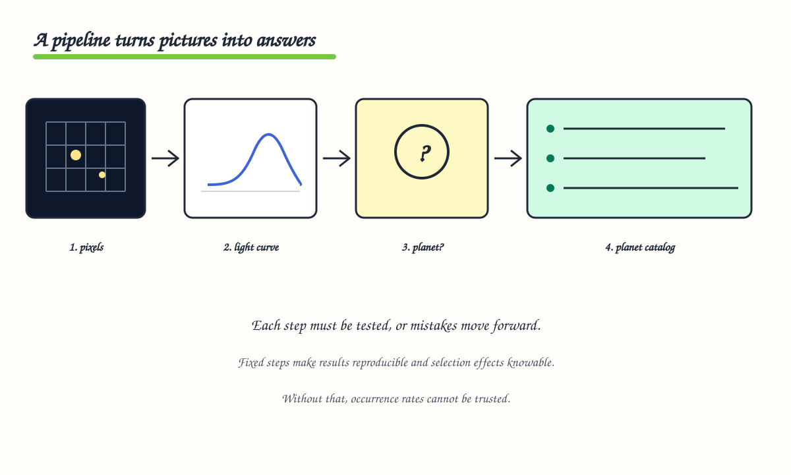

### Know the star to know the planet

Transit and microlensing mostly measure ratios between planet and star. Get the star's size or mass wrong and every planet in the sample shifts with it. SED fitting and isochrones are the usual way to pin down the host.

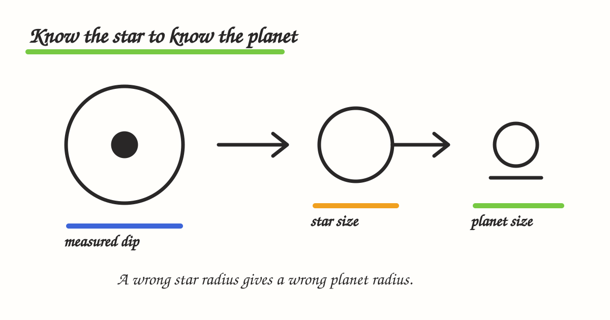

---

## Level 9 - Follow-up and future missions 

### More telescopes add more clues

A Roman detection is often just the start. Earlier images (before the event) and later images (years after, when lens and source separate) add motion, distance, and mass information the original light curve could not provide.

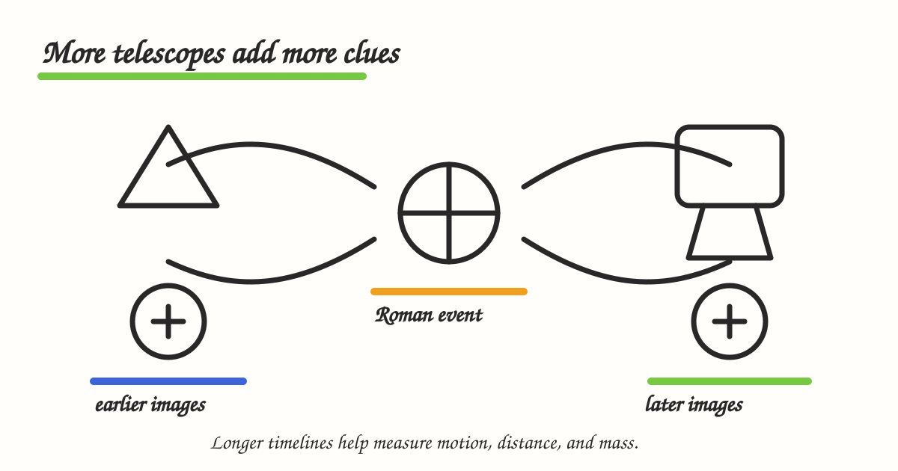

---

## Level 10 - Hands-on roadmap (Wrap-up)

### Science improves in a loop

Ask a question, build a model, test with data, learn, and repeat. A failed prediction is useful - it shows what to improve. The Hands-On II group project notebook is one full lap around this loop: concepts, data, models, and interpretation feeding each other.

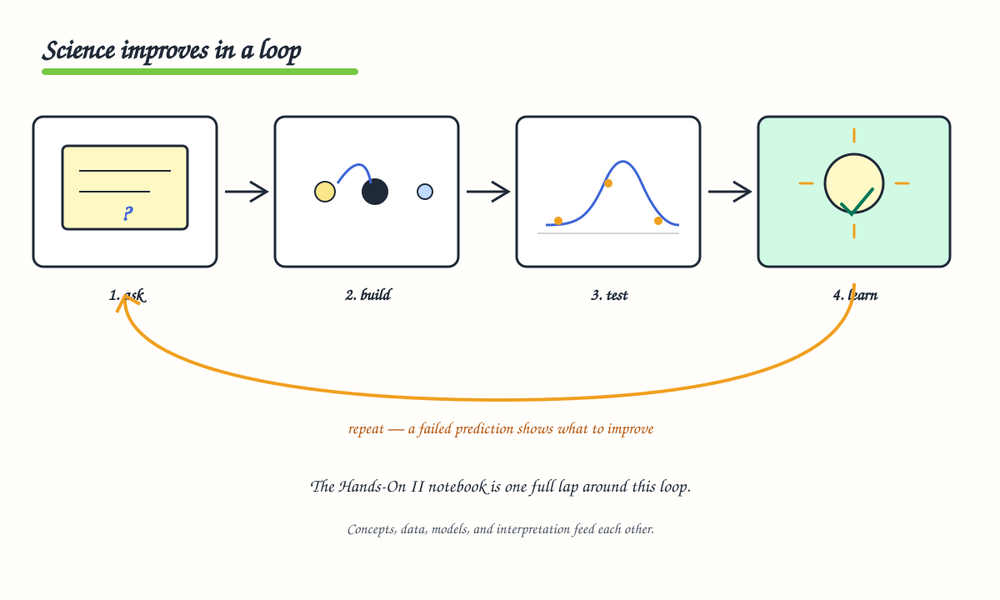
