# Roman Space Telescope

A focused guide to the **Nancy Grace Roman Space Telescope**, built from the 2026 Sagan Summer Workshop screenshots in [`Image ppt/best/`](Image%20ppt/best/) and new comparison graphs against **Hubble** and **Euclid**.

All images used on this page live in [`assets/roman_assets/`](assets/roman_assets/).

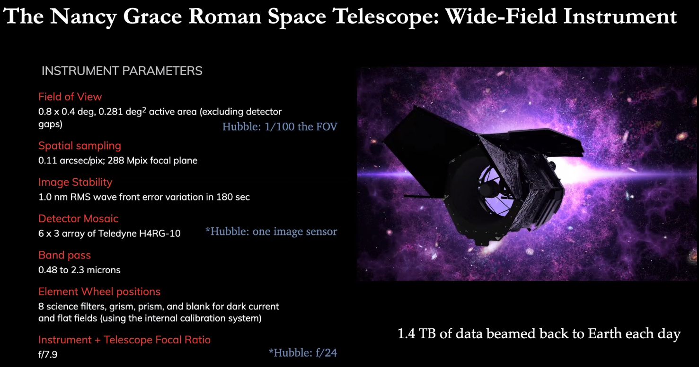

Roman is designed as a **wide-field infrared survey observatory**: Hubble-class angular resolution over roughly **100× Hubble’s field of view**, optimized for dark energy, Galactic astrophysics, and a transformative exoplanet census via microlensing and transits.

---

## Contents

1. [What Roman is](#1-what-roman-is)
2. [Hubble · Euclid · Roman — generated comparison graphs](#2-hubble--euclid--roman--generated-comparison-graphs)
3. [Workshop cover images (Image ppt/best)](#3-workshop-cover-images-image-pptbest)
4. [Why the three telescopes work together](#4-why-the-three-telescopes-work-together)
5. [Galactic surveys and data volume](#5-galactic-surveys-and-data-volume)
6. [Exoplanet reach](#6-exoplanet-reach)
7. [Coronagraph technology path](#7-coronagraph-technology-path)
8. [Further reading in this repo](#8-further-reading-in-this-repo)

---

## 1. What Roman is

| Item | Detail |
|---|---|
| Full name | Nancy Grace Roman Space Telescope (RST) |
| Primary mirror | **2.4 m** (same class as Hubble) |
| Main camera | Wide Field Instrument (WFI) |
| Active FOV | **0.8° × 0.4° → 0.281 deg²** |
| Sampling | **0.11″/pix**, 288 Mpix focal plane |
| Detectors | **6 × 3** Teledyne H4RG-10 mosaic |
| Bandpass | **0.48–2.3 μm** (8 science filters + grism + prism + blank) |
| Focal ratio | **f/7.9** (vs Hubble f/24) |
| Orbit | Sun–Earth **L2** |
| Downlink | **~1.4 TB/day** |

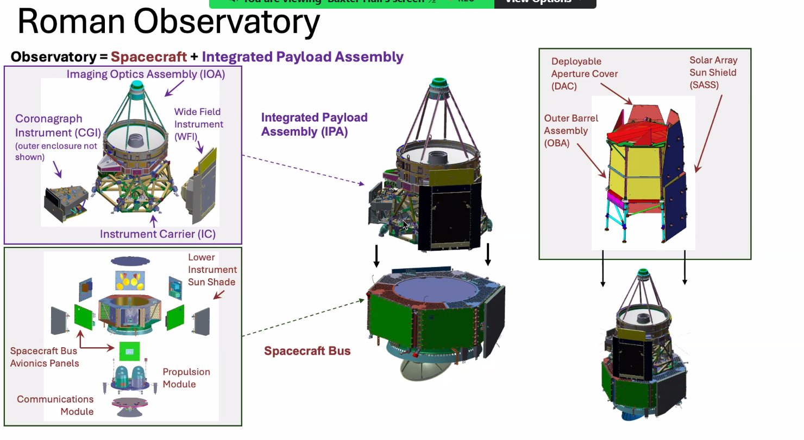

Roman’s observatory splits into an **Integrated Payload Assembly** (optics + WFI + Coronagraph Instrument) and a **spacecraft bus** (avionics, propulsion, communications), wrapped by the Outer Barrel Assembly and Solar Array Sun Shield.

---

## 2. Hubble · Euclid · Roman — generated comparison graphs

These diagrams are original redraws for this README. They expand the workshop “Photometry Party!” and WFI-parameter slides into minute-detail comparisons.

### Specs side by side

Mirror size, FOV, pixel scale, detectors, bandpass, focal ratio, orbit, and science mode.

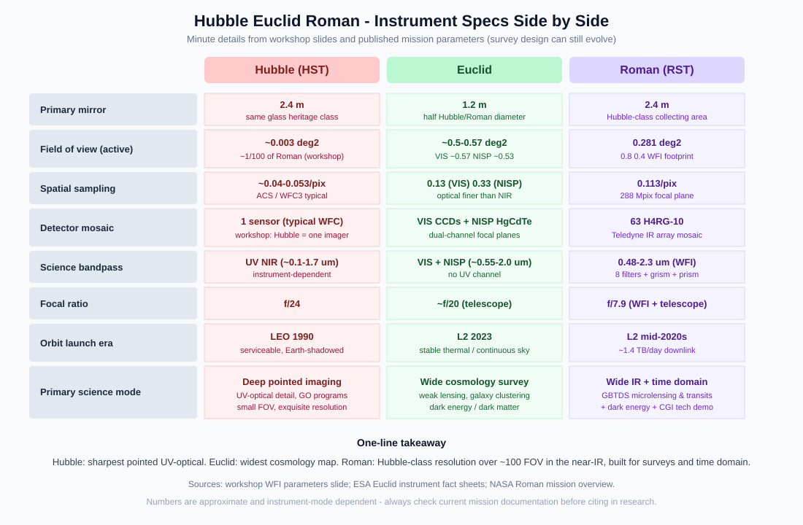

### Field of view to scale

Roman is ~**100×** Hubble’s FOV; Euclid’s single pointing is still wider (~0.5–0.57 deg²), but Roman pairs that survey footprint with a **2.4 m** aperture and finer IR sampling.

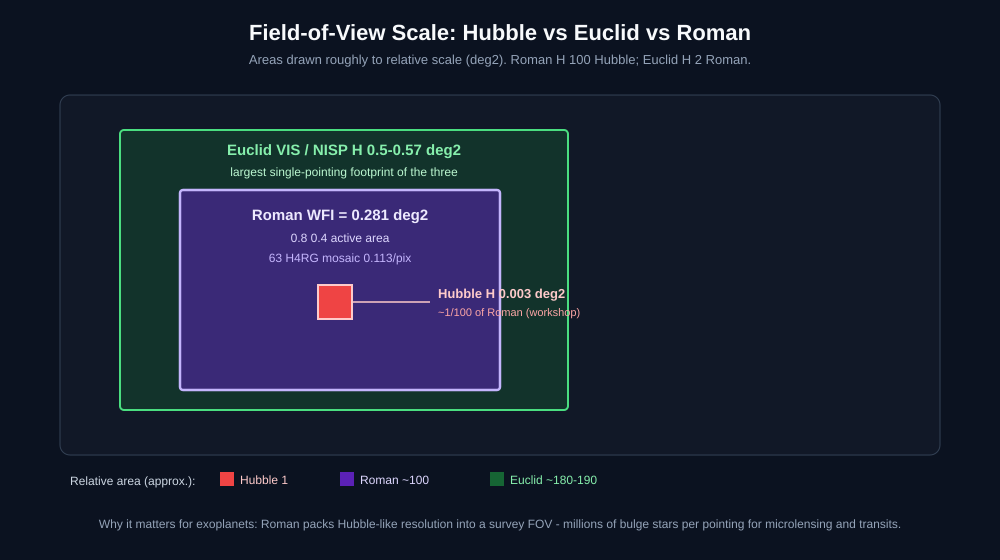

### Primary mirrors

Collecting area scales as diameter² — Euclid’s 1.2 m mirror gathers roughly **¼** the light of Hubble or Roman for the same exposure. The diagram pairs **realistic telescope views** with mirrors drawn to linear diameter scale.

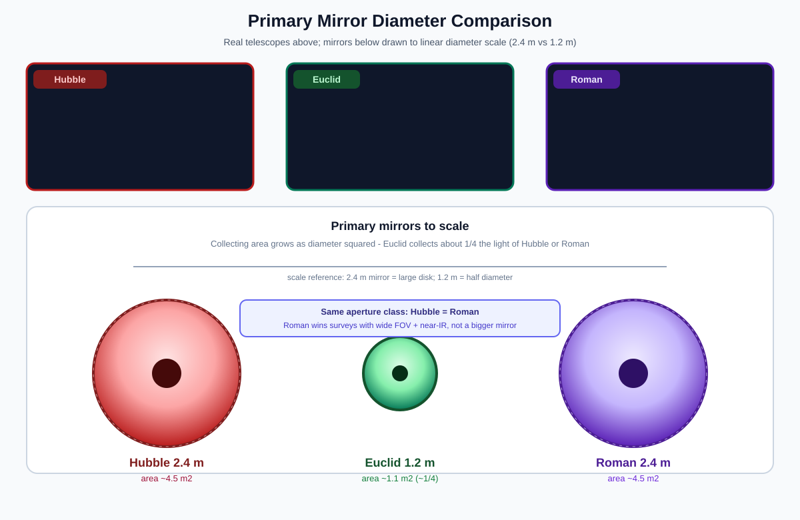

### Wavelength and filters

Redrawn from the workshop Photometry Party cover, with Euclid’s **NISP YJH** channel included (the original slide highlighted VIS).

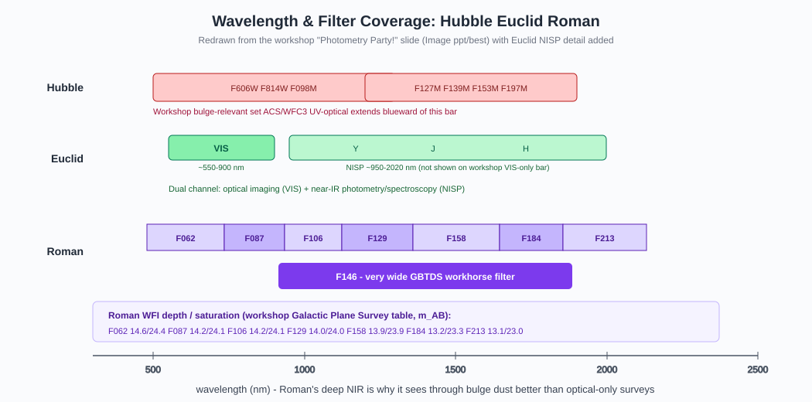

### Science niches

What each observatory does best, where it is limited, and how it feeds Roman exoplanet work — with a photo of each telescope at the top of its card.

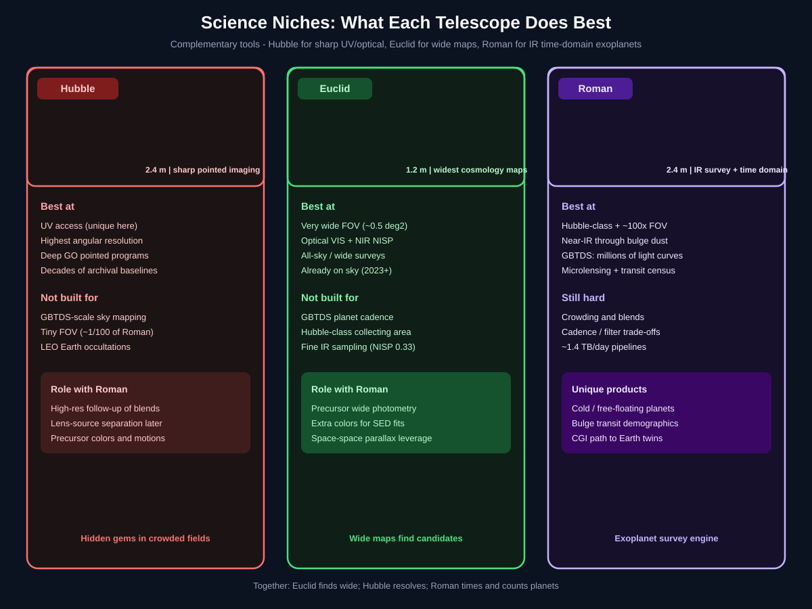

### Survey scale on the Galactic plane

Roman’s plane survey (wide 691 + time-domain 19 + deep ~5 deg²) versus the workshop’s Hubble prior footprint (~6 deg²). Euclid’s cosmology Wide Survey (~15,000 deg²) is a different sky goal.

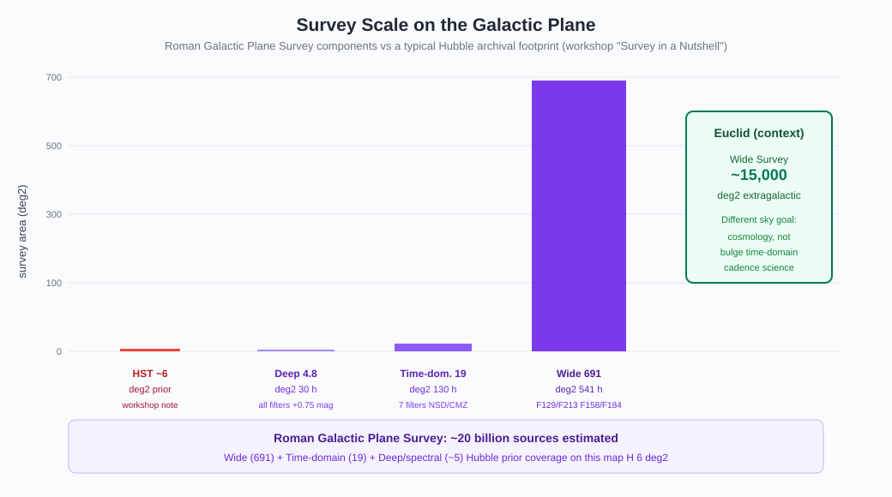

### Minute details that change inference

Crowding at 0.1″ ≈ 800 AU, multi-mission colors through dust, and cadence / parallax geometry — illustrated with telescope portraits plus simple visual metaphors for blends, dust, and light-curve timing.

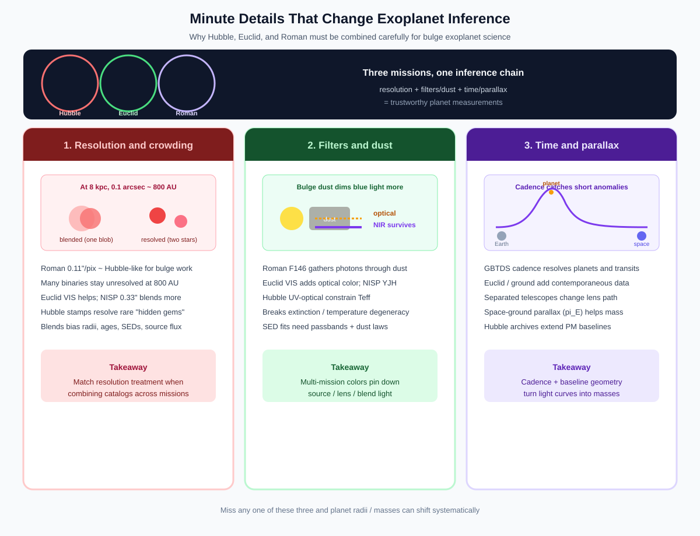

Also useful from the same folder:

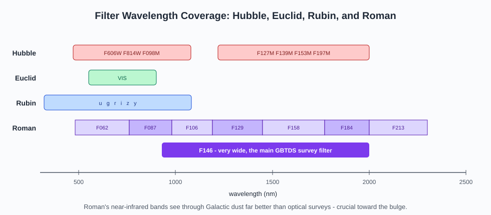

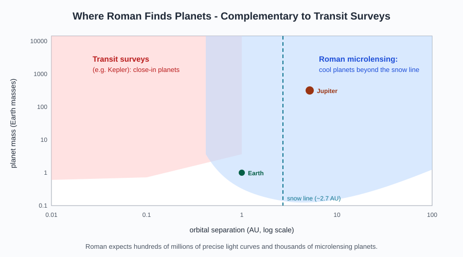

---

## 3. Workshop cover images (`Image ppt/best`)

Selected best-cover screenshots used on this page (also kept under [`assets/roman_assets/`](assets/roman_assets/)). Credit the original presenters when reusing.

### Photometry Party — Hubble, Euclid, Rubin, Roman

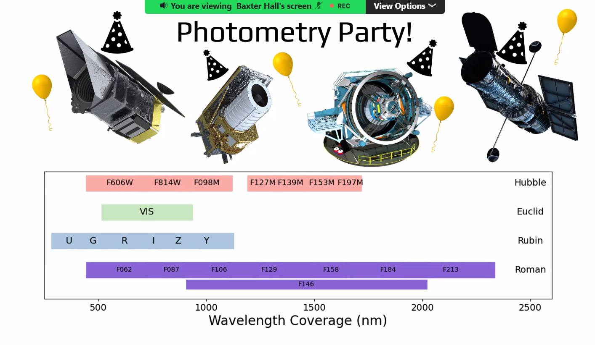

### Euclid wide field vs Hubble postage stamps

Wide surveys find candidates; Hubble (and later Roman-resolution imaging) reveals the “hidden gems.”

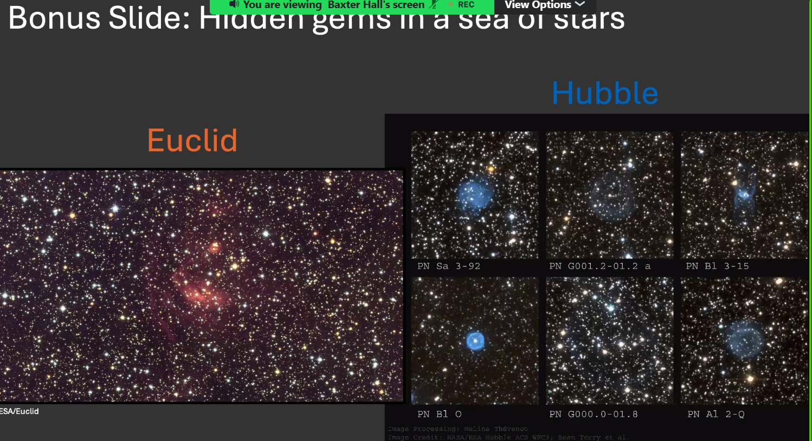

### Contemporaneous surveys (Roman + Euclid + ground)

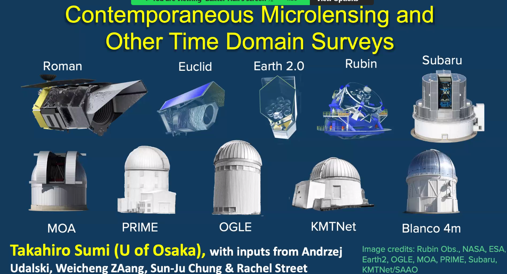

### WFI instrument parameters (vs Hubble callouts)

### Galactic Plane Survey in a nutshell

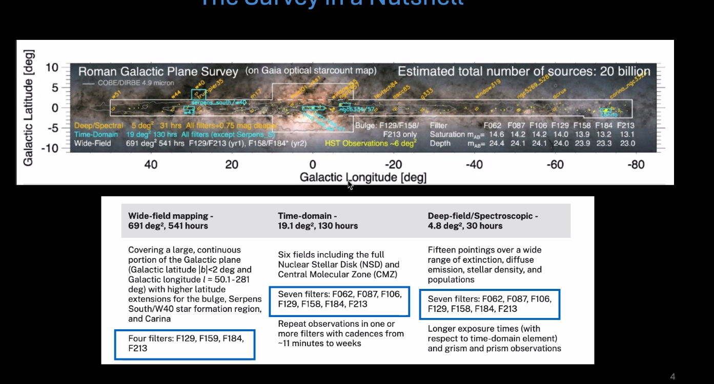

### From images to microlensing exoplanets

### Planet-mass / separation reach

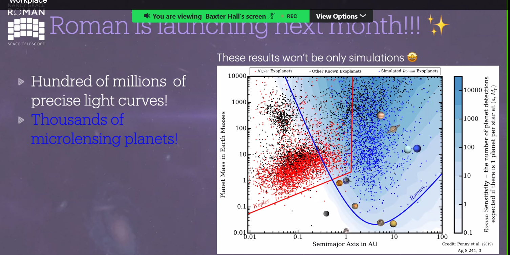

---

## 4. Why the three telescopes work together

| Need | Hubble | Euclid | Roman |
|---|---|---|---|
| UV / finest pointed stamps | best | — | IR-focused |
| Wide optical + NIR map already on sky | archival | best now | upcoming |
| Bulge time-domain cadence | too small FOV | not GBTDS-designed | purpose-built |
| Cold microlensing planets | rare / targeted | limited | thousands expected |
| Blend / binary follow-up | high-res imaging | colors + positions | survey + later AO/space |

Cross-mission use requires consistent **source matching**, **zero points**, **passband models**, **angular-resolution treatment**, and **observation times** — otherwise colors and proper motions silently bias host and planet properties.

See also: [09 — Follow-up and future missions](topics/09-follow-up-and-future.md).

---

## 5. Galactic surveys and data volume

Workshop Galactic Plane Survey strawman (design can evolve):

| Component | Area | Time | Notes |
|---|---:|---:|---|
| Wide-field mapping | 691 deg² | 541 h | F129/F213 then F158/F184 |
| Time-domain | ~19 deg² | 130 h | 7 filters; NSD/CMZ; cadence minutes→weeks |
| Deep / spectral | ~5 deg² | ~30 h | +0.75 mag; grism/prism |

Estimated sources: **~20 billion**. WFI depth/saturation (m_AB) from the workshop table:

| Filter | Saturation | Depth |
|---|---:|---:|
| F062 | 14.6 | 24.4 |
| F087 | 14.2 | 24.1 |
| F106 | 14.2 | 24.1 |
| F129 | 14.0 | 24.0 |
| F158 | 13.9 | 23.9 |
| F184 | 13.2 | 23.3 |
| F213 | 13.1 | 23.0 |

At bulge distances, **0.1″ ≈ 800 AU**, so many binaries remain unresolved — a first-order systematic for ages, radii, and microlensing blend flux.

---

## 6. Exoplanet reach

Roman’s Galactic Bulge Time Domain Survey (GBTDS) is expected to deliver:

- **Hundreds of millions** of precise light curves
- **Thousands** of microlensing planets (including cold and free-floating lenses)
- A large **transit** sample in a new Galactic environment

The same images feed both channels. Microlensing fills the snow-line and beyond; transits prefer short periods. Neither catalog is the true population until selection functions and Galactic context are applied.

Course notes: [01 — Roman and the GBTDS](topics/01-roman-and-gbtds.md) · [03 — Microlensing](topics/03-microlensing-fundamentals.md) · [05 — Transits](topics/05-transits.md).

---

## 7. Coronagraph technology path

Roman’s Coronagraph Instrument (CGI) is a **technology demonstrator** for the wavefront control, deformable mirrors, masks, and photon-counting detectors needed to image Earth-like planets with a future flagship.

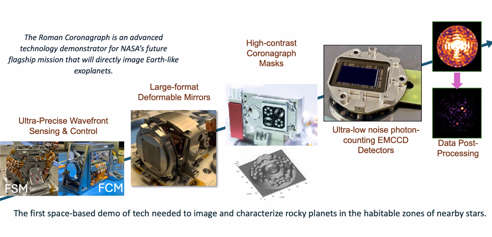

That path sits alongside — not instead of — the statistical census from WFI microlensing and transits.

---

## 8. Further reading in this repo

- [Main course README](README.md) — full learning path
- [Roman assets folder](assets/roman_assets/) — every image used on this page
- [Generated diagrams gallery](IMAGE_GALLERY.md)
- [Workshop slides gallery](SLIDES_GALLERY.md)
- [Key concepts gallery](KEY_CONCEPTS_GALLERY.md)
- [Hands-on notebooks](Assignments%20Notebooks/README.md)

### External

- [NASA Roman Space Telescope](https://roman.gsfc.nasa.gov/)
- [ESA Euclid](https://www.esa.int/Science_Exploration/Space_Science/Euclid)
- [NASA Hubble](https://science.nasa.gov/mission/hubble/)
- [Sagan Summer Workshop YouTube](https://www.youtube.com/@SaganSummerWorkshop)

---

## Scope and caution

These notes are a learning aid from workshop screenshots and generated diagrams, not official mission documentation. Survey fields, cadences, depths, and yields can change. Verify numbers against current NASA/ESA sources before citing them in research.
