# Workshop Slides Gallery

The original workshop slide screenshots, ordered by the same learning path as the [README](README.md). All images here are workshop-derived material - **credit the original presenters** (2026 Sagan Summer Workshop) when reusing them.

These are kept separate from the [key concepts gallery](KEY_CONCEPTS_GALLERY.md) and the [generated diagrams gallery](IMAGE_GALLERY.md). Where a slide has a cleaner redrawn version, the caption links to it.

The screenshots below are the renamed copies in `assets/slides/`. The raw, unedited originals live in [`Image ppt/`](Image%20ppt/), with the curated picks in [`Image ppt/best/`](Image%20ppt/best/).

---

## Level 1 - Roman and the GBTDS

Roman hardware as shown during the workshop.

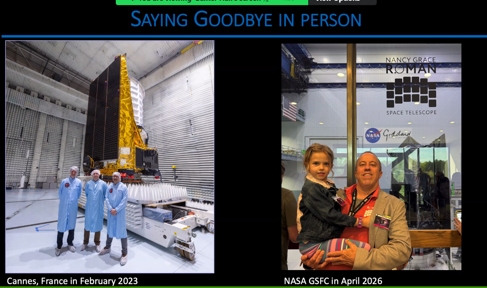

Known planets occupy method-dependent regions of parameter space.

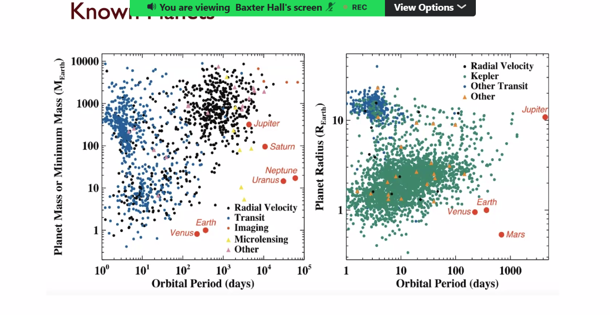

Roman's sensitivity across planet mass and separation, compared with Kepler (redrawn as the [sensitivity map](assets/generated/roman-sensitivity-map.svg)).

---

## Level 2 - Planet formation and populations

Stellar mass and metallicity influence protoplanetary disks and the observed planet populations.

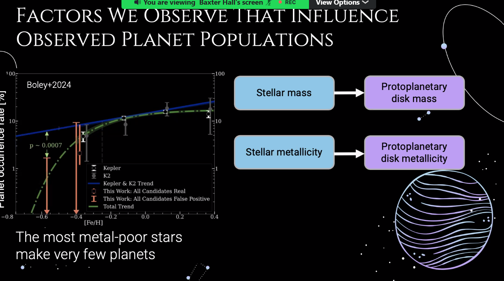

---

## Level 3 - Microlensing fundamentals

Real examples of microlensing and non-microlensing light curves (redrawn as the [candidate checklist](assets/generated/microlensing-candidate-checklist.svg)).

The lensing cross-section sweeps angular area as the lens moves, setting the event rate.

---

## Level 4 - Advanced microlensing and yields

Model categories and acronyms (redrawn as the [model-category table](assets/generated/microlensing-model-categories.svg)).

The model-fitting loop (redrawn as the [fitting loop](assets/generated/model-fitting-loop.svg)).

Comparison of model-fitting software (redrawn as the [tools comparison](assets/generated/microlensing-fitting-tools.svg)).

The workshop definition of a survey yield.

PopSyCLE-style population synthesis and mock lensing survey.

A second view of a microlensing simulation workflow.

The gulls simulator visualization.

---

## Level 5 - Transits

The distinction between false alarms and false positives.

Transit population features in period and radius.

---

## Level 6 - Galactic context and dust

Milky Way anatomy: disk, bulge, bar, and nuclear structures.

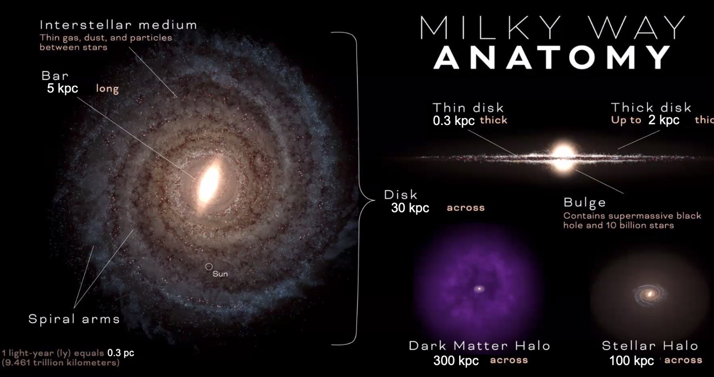

The ingredients of a Galactic model.

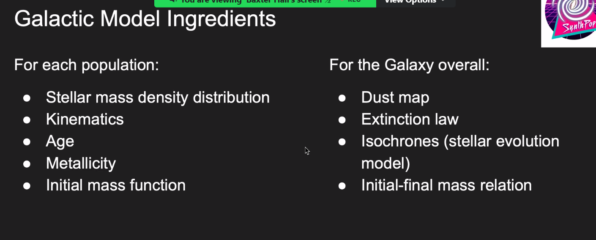

The Milky Way's appearance changes strongly with wavelength - dust is transparent in the infrared.

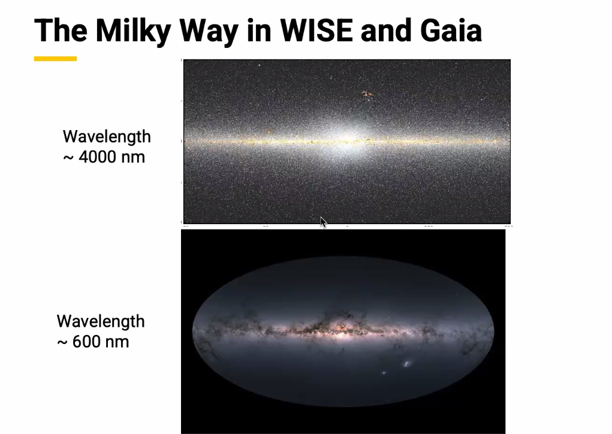

---

## Level 7 - Occurrence rates

From light curves to occurrence rates.

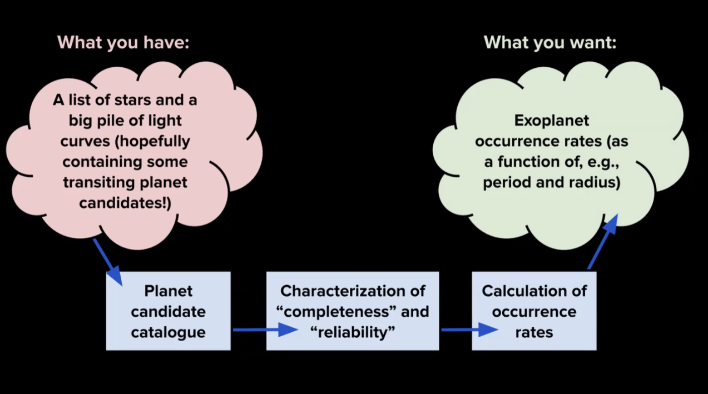

An example grid-based occurrence-rate approach.

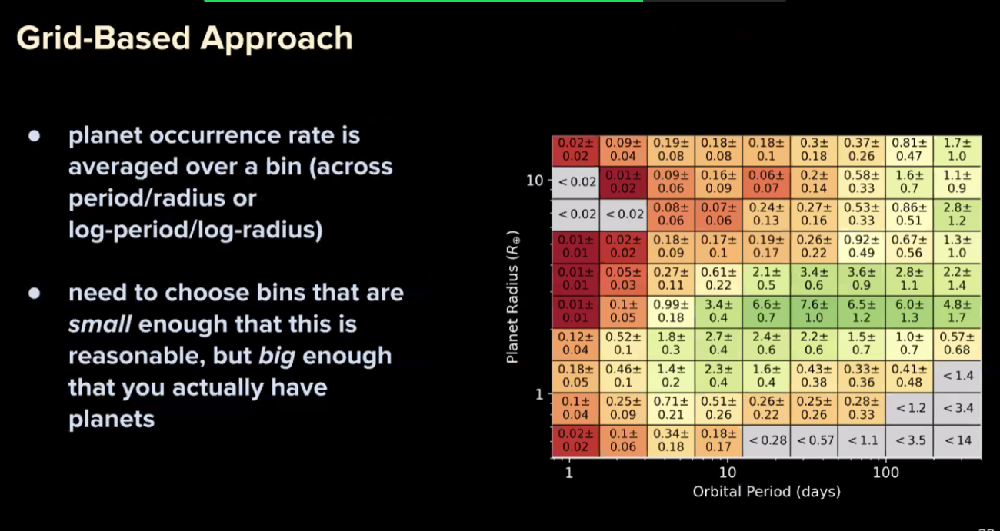

Observed transit planets become occurrence rates only after corrections.

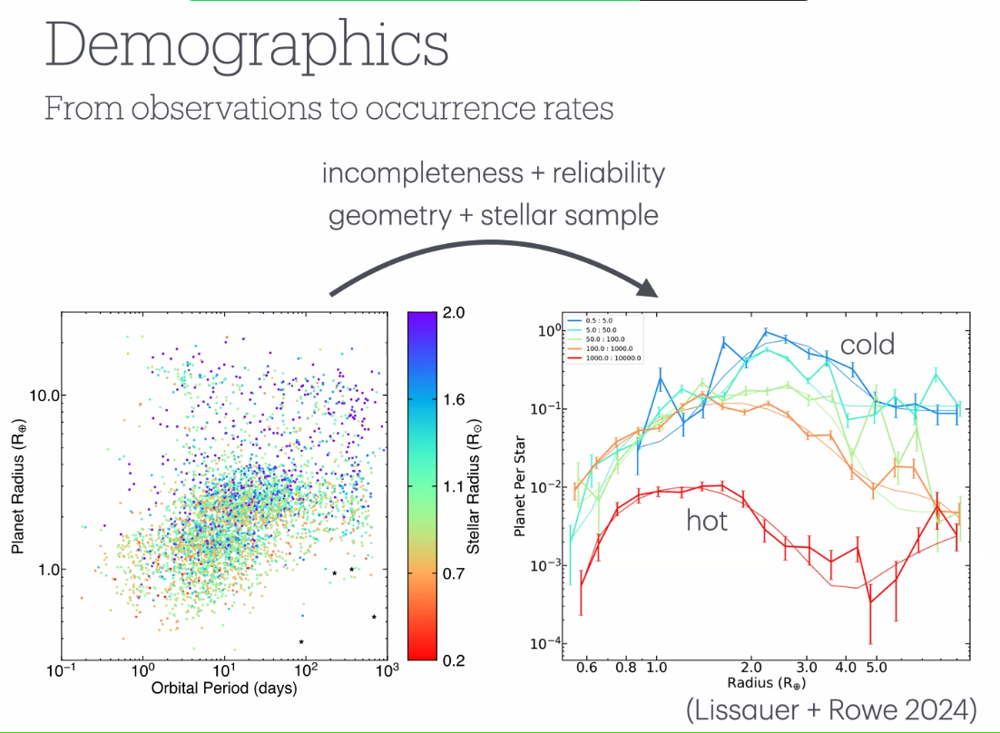

---

## Level 8 - Pipelines and host stars

The workflow from Roman images to population studies (redrawn as the [images-to-populations chain](assets/generated/images-to-populations-chain.svg)).

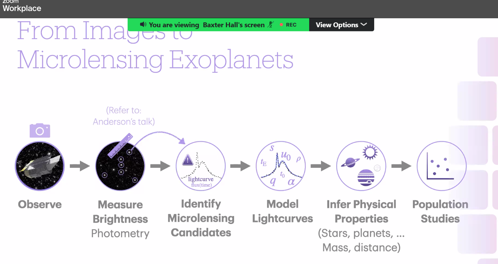

The pipeline summary from candidate identification to physical inference (redrawn as the [three-stage summary](assets/generated/microlensing-pipeline-summary.svg)).

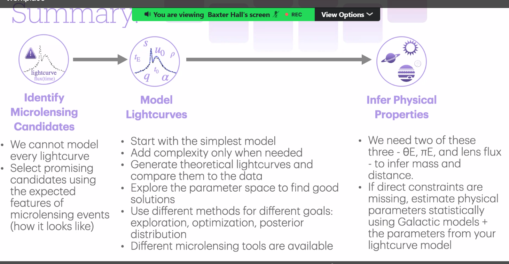

Planned Roman MSOS pipeline products (redrawn as the [products-by-cadence chart](assets/generated/msos-pipeline-products.svg)).

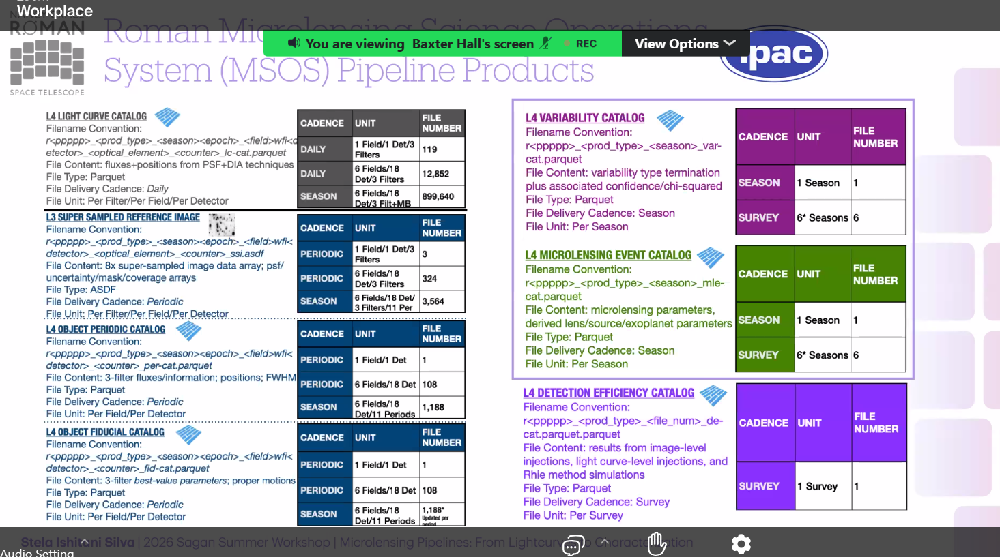

The SED-fitting workflow and software examples (redrawn as the [SED-fit ingredients](assets/generated/sed-fitting-ingredients.svg)).

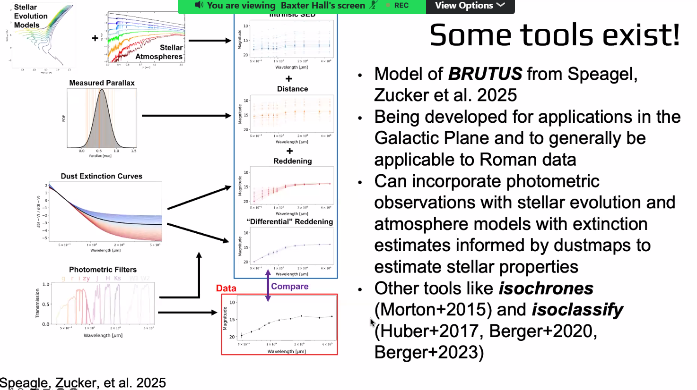

Biases from unresolved binaries and blends (redrawn as the [binaries-and-blends diagram](assets/generated/binaries-and-blends.svg)).

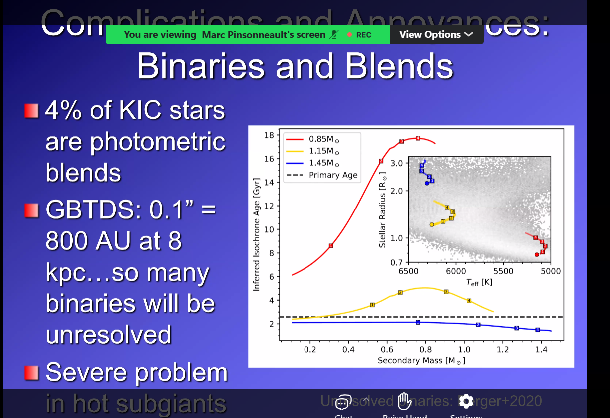

Ideas for independent pipeline investigation-team analyses (redrawn as the [PIT comparison](assets/generated/pit-independent-analyses.svg)).

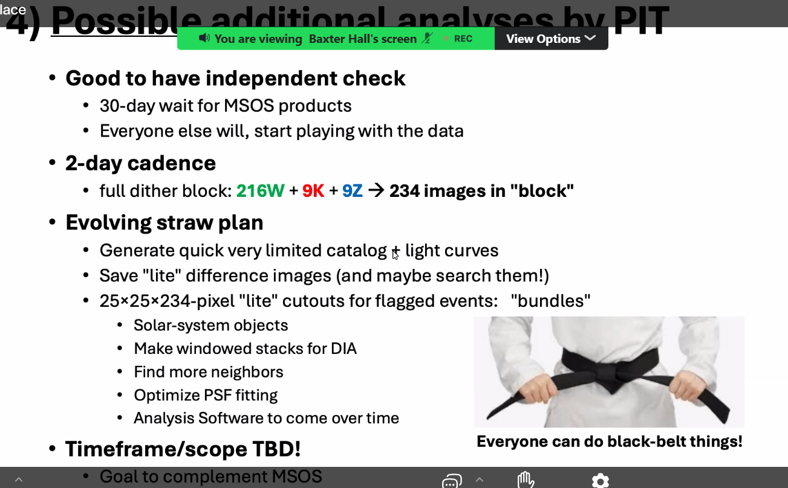

---

## Level 9 - Follow-up and future missions

Filter comparison across Hubble, Euclid, Rubin, and Roman (redrawn as the [filter coverage chart](assets/generated/filter-wavelength-coverage.svg)).

