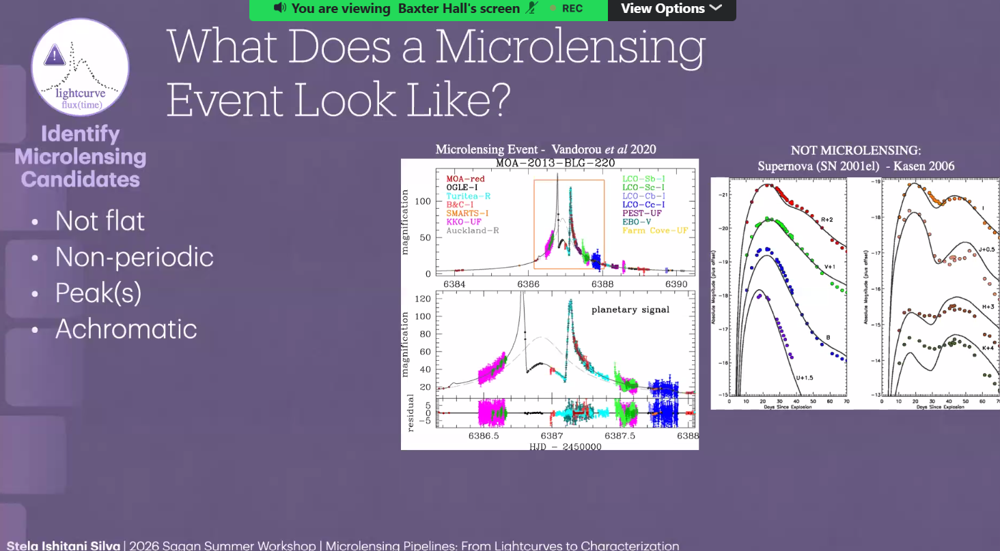
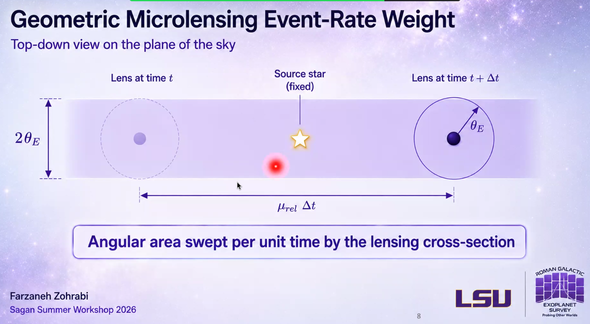

# 03 — Microlensing Fundamentals

[← Planet populations](02-planet-formation-and-populations.md) · [Course index](../README.md) · [Next: Advanced microlensing →](04-advanced-microlensing-and-yields.md)

## 1. The physical idea

General relativity predicts that mass bends spacetime and deflects light. If a foreground **lens** passes close to the line of sight to a background **source**, the source appears brighter. The images are usually too close to resolve, so we observe their combined magnification versus time.

Required ingredients:

- observer;
- foreground lens;
- background source;
- changing alignment due to relative motion.

## 2. Einstein radius

For a point lens of mass \(M_L\):

\[
\theta_E
=
\sqrt{\kappa M_L\pi_{\rm rel}},
\qquad
\pi_{\rm rel}
=
\mathrm{AU}\left(\frac{1}{D_L}-\frac{1}{D_S}\right),
\]

where \(\kappa=4G/(c^2\mathrm{AU})\), \(D_L\) is lens distance, and \(D_S\) is source distance.

The physical Einstein radius is \(R_E=D_L\theta_E\). It sets the natural spatial scale of the event.

## 3. Point-source, point-lens light curve

Define angular separation in Einstein-radius units:

\[
u(t)
=
\sqrt{u_0^2+\left(\frac{t-t_0}{t_E}\right)^2}.
\]

The magnification is:

\[
A(u)=\frac{u^2+2}{u\sqrt{u^2+4}}.
\]

Core parameters:

- \(t_0\): time of closest approach;
- \(u_0\): minimum source–lens separation in units of \(\theta_E\);
- \(t_E=\theta_E/\mu_{\rm rel}\): Einstein crossing time;
- \(\mu_{\rm rel}\): lens–source relative proper motion.

A smaller \(u_0\) gives higher peak magnification.

## 4. What the detector measures

The observed flux is commonly modeled as:

\[
F(t)=F_S A(t)+F_B,
\]

where \(F_S\) is source flux and \(F_B\) is blended light from unrelated stars, companions, or the lens.

Blending can make the event appear less strongly magnified and can bias physical interpretation if ignored.

### A first candidate check

A useful microlensing candidate is usually:

- **not flat:** its brightness changes significantly;
- **non-periodic:** the event normally happens once;
- **peaked:** a simple lens produces one smooth, symmetric peak, while planets can add short extra peaks or dips;
- **approximately achromatic:** gravity itself magnifies every wavelength by the same factor.

Achromatic does not mean every measured band must look numerically identical. Blended stars, finite-source effects, stellar variability, and wavelength-dependent systematics can introduce color-dependent measurements.

## 5. How a planet appears

A host plus planet is a **binary lens**. The planet perturbs the host's magnification pattern and creates **caustics**—curves of formally infinite point-source magnification. A real finite star smooths the divergence.

Binary-lens parameters commonly include:

- mass ratio \(q=M_p/M_\star\);
- projected separation \(s\) in Einstein-radius units;
- source-trajectory angle \(\alpha\);
- normalized source radius \(\rho=\theta_\star/\theta_E\).

The planetary signal is usually a short anomaly on a longer host-lens event. Lower \(q\) usually means a smaller, shorter perturbation.

## 6. Caustics

- **Central caustic:** near the host; important in high-magnification events.
- **Planetary caustic:** displaced from the host; location depends on \(s\).
- **Caustic crossing:** source enters or exits a caustic, producing sharp features.
- **Finite-source effect:** the source's angular size is resolved by the magnification pattern.

If \(\rho\) and the source angular radius \(\theta_\star\) are known:

\[
\theta_E=\frac{\theta_\star}{\rho}.
\]

This is an important route toward physical lens properties.

## 7. The close–wide degeneracy

Binary-lens geometries with separations \(s\) and approximately \(1/s\) can create similar central-caustic light curves. This **close–wide degeneracy** means excellent photometry may still allow distinct physical models.

## 8. Why microlensing is special

Strengths:

- sensitive to low-luminosity or dark lenses;
- probes cool planets at wider projected separation;
- can detect low planet-to-host mass ratios;
- can detect isolated, free-floating candidates;
- does not require planetary orbital repetition.

Limitations:

- alignments are usually one-time events;
- mass is not determined from \(t_E\) alone;
- crowded fields create blending;
- model degeneracies can persist;
- population inference needs event-rate and detection-efficiency models.

## 9. Event rate intuition

The event rate grows with:

- the number density of lenses and sources;
- angular lensing cross-section \(\sim2\theta_E\);
- relative proper motion \(\mu_{\rm rel}\).

An event timescale distribution therefore mixes lens mass, geometry, and motion.

## 10. Check your understanding

1. Why does \(t_E\) alone not uniquely determine lens mass?
2. What does a planetary anomaly measure more directly: planet mass or mass ratio?
3. Why do finite-source effects help measure \(\theta_E\)?
4. What does blended flux do to an observed light curve?

