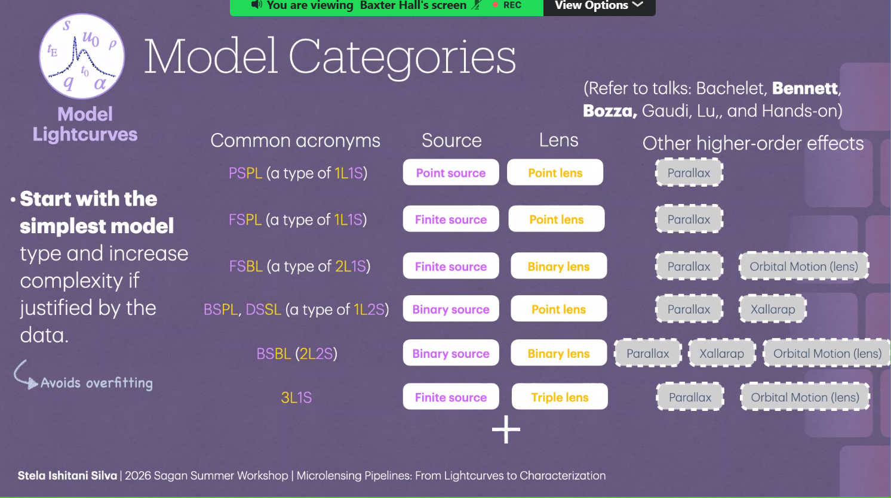
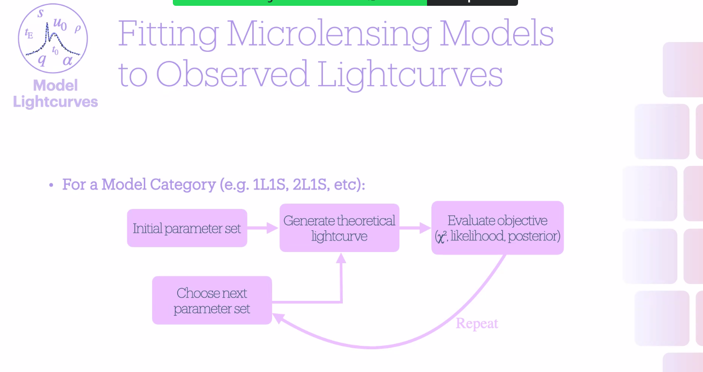
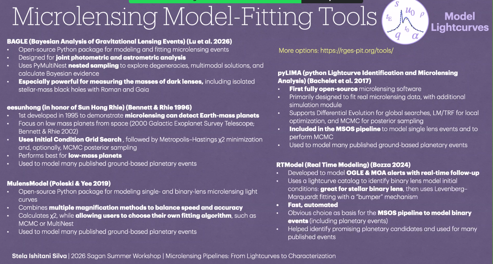
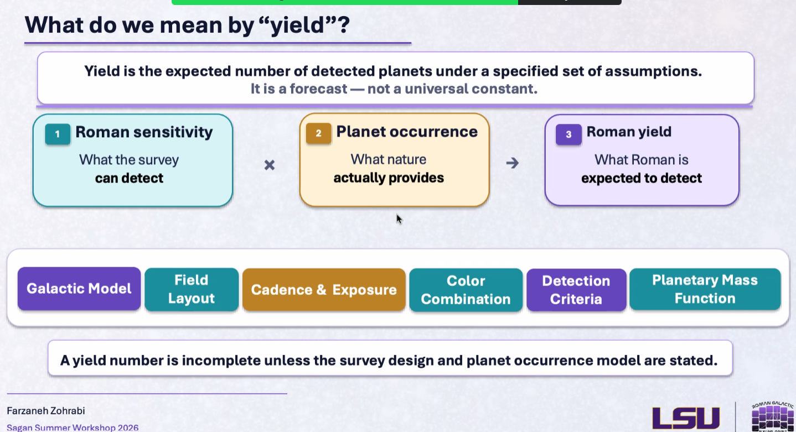
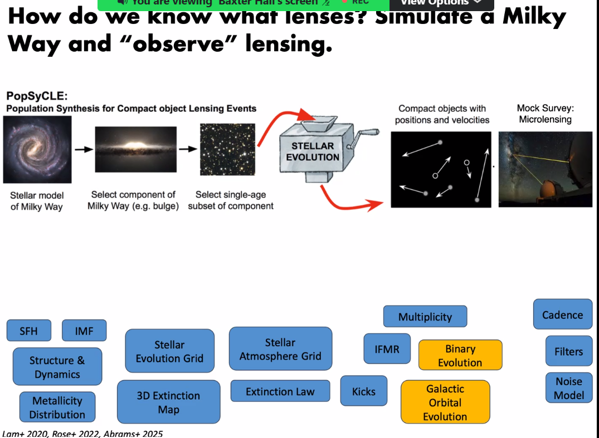
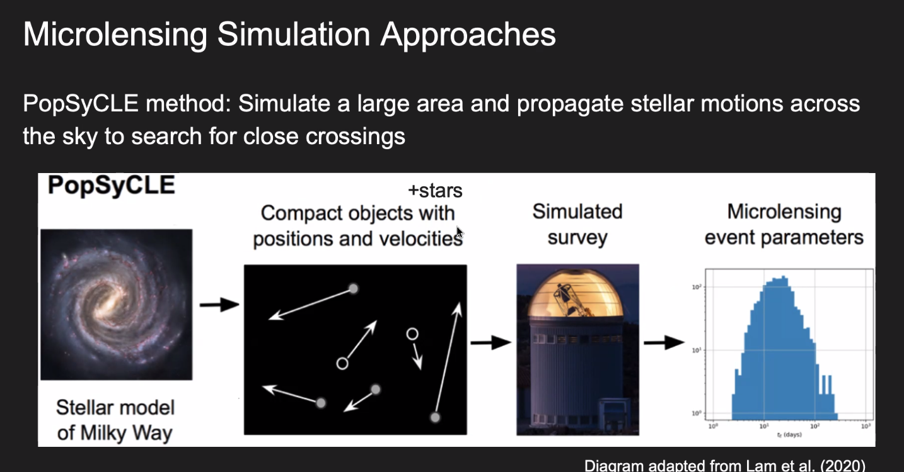
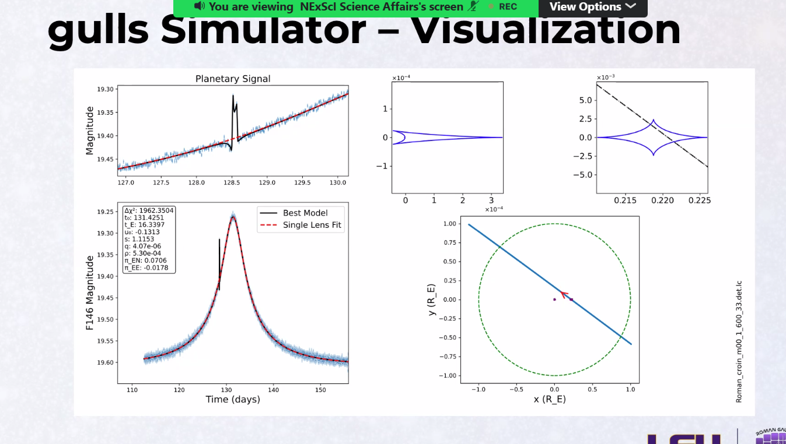

# 04 — Advanced Microlensing, Host Stars, and Yields

[← Microlensing fundamentals](03-microlensing-fundamentals.md) · [Course index](../README.md) · [Next: Transits →](05-transits.md)

## 1. From dimensionless fits to physical masses

A binary-lens fit often gives \(q\), \(s\), \(t_E\), and sometimes \(\rho\). To obtain physical mass and distance, we seek:

- angular Einstein radius \(\theta_E\);
- microlens parallax \(\pi_E\);
- lens flux or high-resolution astrometric separation;
- a Galactic prior when direct constraints are incomplete.

If both \(\theta_E\) and \(\pi_E\) are measured:

$$
M_L=\frac{\theta_E}{\kappa\pi_E},
\qquad
\pi_{\rm rel}=\theta_E\pi_E.
$$

Then \(M_p=qM_L\).

## 2. Higher-order effects

### Microlens parallax

Earth's acceleration or separated observatories alter the apparent trajectory. The microlens-parallax vector \(\boldsymbol{\pi}_E\) encodes projected lens geometry.

### Lens orbital motion

For binary lenses, \(s\) and trajectory orientation can change during an event. Ignoring this can bias parameters, but over-flexible orbital models can fit noise.

### Finite-source and limb-darkening effects

During caustic interactions, different parts of a resolved stellar disk are magnified differently. This measures \(\rho\) and can probe source intensity profiles.

### Astrometric microlensing

The unresolved image centroid shifts as magnification changes. Astrometry can constrain \(\theta_E\) and is particularly useful for dark or massive lenses.

### Xallarap

Orbital motion of the **source** around a companion can mimic parallax-like distortions. Competing physical models must be tested.

## 3. Choosing a model family

Microlensing model names describe the number and size treatment of sources and lenses:

- **PSPL / 1L1S:** point source, point lens; the simplest standard event;
- **FSPL:** finite source, point lens;
- **FSBL / 2L1S:** finite source, binary lens; commonly used for planet or stellar-binary lenses;
- **BSPL / 1L2S:** binary source, point lens;
- **BSBL / 2L2S:** binary source, binary lens;
- **3L1S:** triple lens, such as a host with two companions.

Parallax, xallarap, and lens orbital motion are higher-order additions, not separate basic source/lens counts.

Start with the simplest physically sensible model. Add complexity only when residual structure, information criteria, posterior checks, and physical plausibility justify it. A lower raw \(\chi^2\) alone is not enough if extra flexibility merely fits noise.

## 4. Fitting a microlensing model

Fitting is an iterative search:

1. choose a model family and initial parameters;
2. generate its theoretical light curve at observation times;
3. evaluate a likelihood or posterior against the data;
4. propose another parameter set;
5. repeat while exploring distinct minima and degeneracies.

Global methods explore broad or multimodal parameter space; local optimizers refine a nearby solution; samplers estimate posterior distributions. Multiple starting points are essential because microlensing likelihood surfaces can contain disconnected solutions.

Workshop-highlighted software includes:

- **BAGLE:** joint photometric and astrometric Bayesian analysis;
- **eesunhong:** grid-search heritage for low-mass planetary events;
- **MulensModel:** flexible single- and binary-lens modeling;
- **pyLIMA:** open-source fitting with global, local, and sampling methods;
- **RTModel:** rapid automated modeling for alerts and binary events.

Choose software by data type, lens complexity, required speed, inference method, and validation—not by package popularity alone.

## 5. Host-star characterization

Useful strategies include:

- source color and magnitude → estimate \(\theta_\star\);
- finite-source measurement → obtain \(\theta_E\);
- parallax → obtain lens mass;
- high-resolution imaging after the event → resolve lens and source;
- lens flux plus mass–luminosity relations → constrain host mass;
- color-dependent centroid motion → distinguish blended components;
- spectroscopy or SED fitting → constrain stellar properties.

Not all “excess flux” is lens light. It may be an unrelated blend, source companion, or lens companion.

## 6. Major degeneracies and failure modes

- close–wide binary-lens degeneracy;
- sign and component degeneracies in parallax;
- planet versus stellar-binary interpretations;
- lens orbital motion versus parallax;
- xallarap versus parallax;
- uncertain source color in high extinction;
- incorrect photometric uncertainties;
- unmodeled stellar variability;
- multiple local minima in parameter space.

Report competing solutions and their physical plausibility, not just the numerically best fit.

## 7. Roman-specific analysis challenges

- extreme crowding and unresolved blends;
- undersampling or detector-dependent point-spread functions;
- enormous event volume;
- short anomalies requiring reliable cadence;
- seasonal gaps;
- variable stars and detector artifacts;
- simultaneous photometric and astrometric modeling;
- expensive binary-lens calculations;
- a need for automated triage without losing unusual events.

## 8. What “planet yield” means

A yield is an expected number of detections under stated assumptions:

$$
N_{\rm det}
=
\int
\underbrace{\frac{dN_{\rm events}}{d\boldsymbol{x}}}_{\text{Galaxy + survey}}
\underbrace{f_p(\boldsymbol{\phi}\mid\boldsymbol{x})}_{\text{planet population}}
\underbrace{\epsilon(\boldsymbol{\phi},\boldsymbol{x})}_{\text{detection efficiency}}
\,d\boldsymbol{x}\,d\boldsymbol{\phi}.
$$

Here \(\boldsymbol{x}\) represents event/star properties and \(\boldsymbol{\phi}\) planet properties.

Yield is a forecast, not a universal constant. It changes with:

- Galactic model;
- field layout;
- cadence and exposure time;
- filters;
- detector and noise assumptions;
- planet mass function;
- detection threshold and vetting;
- treatment of finite sources, binaries, and systematics.

## 9. Survey simulation

A forward simulator creates a synthetic Galaxy, lenses, sources, planets, observing schedule, noise, and detection process.

The `gulls` visualization shown at the workshop connects simulated light curves, lens geometry, and caustics:

## 10. Validating a yield forecast

A credible forecast should:

1. state survey and population assumptions;
2. reproduce known event-rate constraints where applicable;
3. inject simulated signals into realistic noise;
4. run the same detection logic planned for data;
5. explore sensitivity to alternate Galactic and planet models;
6. propagate Monte Carlo uncertainty;
7. separate “detected,” “characterized,” and “publishable demographic sample.”

## 11. Check your understanding

1. Which two measurements directly determine lens mass?
2. Why is excess blended light not automatically lens light?
3. Why can two correct yield studies predict different numbers?
4. What is the difference between detection yield and characterization yield?
5. Why should a more complex lens model not be selected from raw \(\chi^2\) improvement alone?

