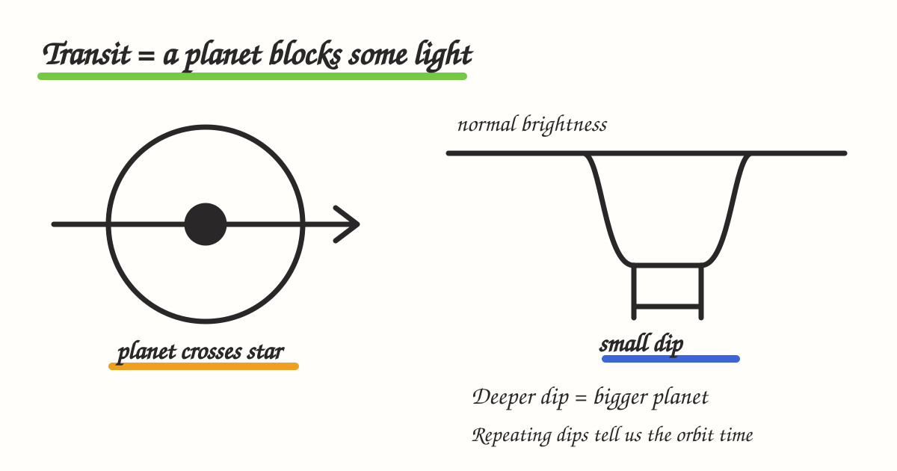
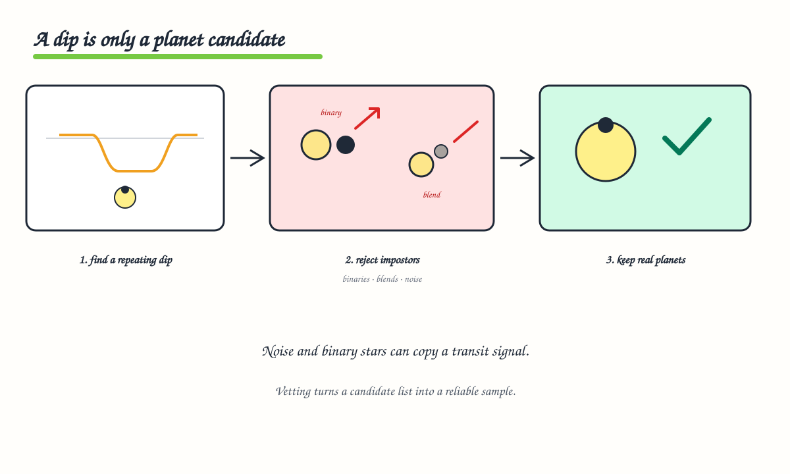
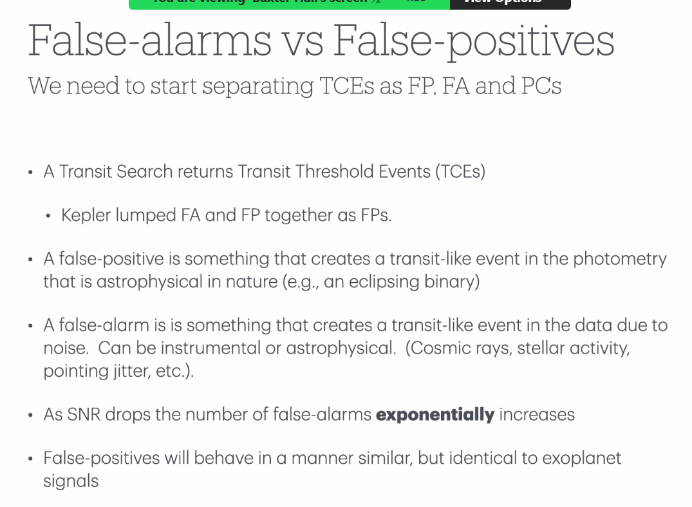
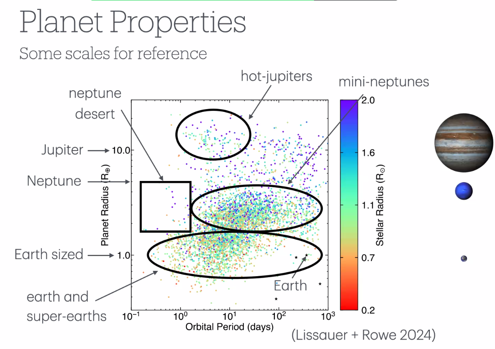

# 05 — Transit Fundamentals and Roman Transits

[← Advanced microlensing](04-advanced-microlensing-and-yields.md) · [Course index](../README.md) · [Next: Galactic context →](06-galactic-context-and-dust.md)

## 1. Transit geometry

A transit occurs when a planet passes in front of its star as seen by the observer. The orbital plane must be nearly edge-on.

For a circular orbit, transit probability is approximately:

$$
p_{\rm tr}\simeq\frac{R_\star+R_p}{a}.
$$

Close-in planets are therefore geometrically favored.

## 2. Transit depth

For a uniformly bright, unblended star and a small planet:

$$
\delta\simeq\left(\frac{R_p}{R_\star}\right)^2.
$$

Earth crossing the Sun produces a depth of roughly \(84\) parts per million. Real transit shapes are affected by:

- stellar limb darkening;
- impact parameter;
- finite exposure time;
- starspots and faculae;
- contamination from neighboring stars;
- instrumental systematics.

## 3. Duration and impact parameter

The **impact parameter**, \(b\), is the projected distance between planet and stellar centers at mid-transit in units of stellar radius. A central transit has \(b\approx0\); a grazing transit has \(b\) near 1.

Transit duration depends on:

- orbital period and speed;
- \(a/R_\star\);
- \(R_p/R_\star\);
- inclination and \(b\);
- eccentricity and argument of periastron.

Duration can constrain stellar density if the orbit is modeled correctly.

## 4. What repeated transits reveal

- spacing → period \(P\);
- depth → radius ratio \(R_p/R_\star\);
- duration and shape → geometry and scaled separation;
- timing deviations → additional bodies;
- depth variations → systematics, stellar activity, precession, or other astrophysics.

Planet radius requires stellar radius:

$$
R_p=\left(\frac{R_p}{R_\star}\right)R_\star.
$$

An inaccurate host star creates an inaccurate planet.

## 5. Searching light curves

Common search concepts:

- **detrending:** remove slow instrumental or stellar variability without erasing transits;
- **Box Least Squares (BLS):** search periodic box-like dips;
- **Transit Least Squares (TLS):** use transit-shaped templates;
- **single-event statistic (SES):** significance of one candidate transit;
- **multiple-event statistic (MES):** combined significance at a trial period;
- **threshold crossing event (TCE):** signal above a defined search threshold;
- **candidate:** a TCE that passes some vetting;
- **validated/confirmed planet:** stronger astrophysical status, with terminology depending on evidence.

## 6. False alarm versus false positive

- **False alarm:** noise or an artifact creates an apparent event—e.g. detector effects, cosmic rays, pointing motion, or stellar variability.
- **False positive:** a real astrophysical signal mimics a planet—e.g. an eclipsing binary, background eclipsing system, or grazing stellar eclipse.

Low SNR creates rapidly increasing false-alarm pressure because enormous numbers of stars, periods, phases, and durations are searched.

## 7. Dilution and crowding

If contaminating flux \(F_c\) enters the aperture:

$$
\delta_{\rm obs}
=
\delta_{\rm true}
\frac{F_\star}{F_\star+F_c}.
$$

Ignoring dilution underestimates \(R_p/R_\star\). Roman's crowded bulge fields make:

- pixel-level localization;
- image subtraction;
- point-spread-function fitting;
- high-resolution catalogs;
- multi-band centroid tests

central to transit validation.

## 8. Roman transit opportunities and challenges

Potential strengths:

- an enormous number of monitored stars;
- stable, high-resolution space photometry;
- sensitivity to a Galactic population different from nearby Kepler/TESS stars;
- shared stellar and Galactic context with microlensing.

Challenges:

- seasonal windows and ambiguous periods;
- strong crowding and dilution;
- correlated noise and stellar variability;
- high computational cost;
- very large candidate volume;
- faint host characterization;
- completeness and reliability calibration.

## 9. Planet populations in period–radius space

The visible clusters and deserts are shaped by nature **and** detection sensitivity. Large, short-period planets are easiest; small or long-period planets require correction for lower completeness.

## 10. Long-period and single transits

If only one transit is observed:

- period is not directly measured;
- duration plus stellar density provides a broad period constraint;
- eccentricity adds degeneracy;
- other surveys or future observations may recover another transit;
- population analyses must include the probability of observing exactly one event.

## 11. Check your understanding

1. Why do transit surveys overrepresent short-period planets?
2. What stellar quantity is needed to turn depth into planet radius?
3. How does blending change inferred planet radius?
4. Give one false alarm and one astrophysical false positive.

